# Тема 200.1 - Измерване и отстраняване на проблеми с ресурсите

## Въведение в Capacity Planning
Основната цел на темата е да се научим как да идентифицираме **тесните места (bottlenecks)** в системата, преди крайните потребители да усетят забавяне в работата. Ключът към успешното управление на една система е умението да се прави корелация между видимите симптоми и реалните хардуерни причини.

### Четирите стълба на мониторинга
За да диагностицираме правилно една Linux система, ще разгледаме ресурсите в четири основни зони:

1.  **CPU (Процесор):** Използване на изчислителната мощ и анализ на опашките от процеси.
2.  **Memory (Памет):** Управление на RAM паметта и предотвратяване на прекомерно използване на Swap (thrashing).
3.  **Disk I/O (Дисков вход/изход):** Скорост на четене/запис и латентност на устройствата за съхранение.
4.  **Network I/O (Мрежов вход/изход):** Пропускателна способност и капацитет на мрежовия интерфейс.

През целия урок ще се стремим да виждаме "цялата картина", съпоставяйки данните от различни инструменти, за да се научим да откриваме виновния процес или хардуерен компонент.


## 1. Мониторинг на процесора (CPU)

### 1.1. Първа помощ с командата `uptime`
Когато влезете в сървър, който "лагва" или показва забавяне, това е първата команда, която трябва да изпълните. Тя дава бърза снимка на състоянието на системата.

**Пример за изход при изпълнение на uptime в node1:**

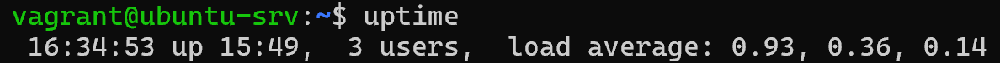

Изходът на командата ни показва:
1.  **Текущото системно време.**
2.  **Uptime:** Колко време машината е работила без рестарт.
3.  **Потребители:** Колко потребители са логнати в момента.
4.  **Load Average:** Средното натоварване за последните 1, 5 и 15 минути.

#### **Формат на времето (up)** 
Uptime-ът се показва в минути, часове или дни в зависимост от продължителността на работата.

**Примери:**
* `up 42 min` (42 минути)
* `up 2:10` (2 часа и 10 минути)
* `up 157 days` (157 дни)

#### **Разбиране на Load Average (Критично за LPIC-2)**
Важно е да се разбере, че това **не е** процент на натоварване на процесора. Load Average е средният брой процеси, които са в състояние:
* **Runnable:** използват или чакат за процесорно време.
* **Uninterruptible sleep:** чакат за входно-изходни операции (диск или мрежа).

**Правилото на моста**\
За да разберем стойностите, нека си представим процесора като мост с една лента:

* **Load 0.50:** Мостът е полупразен. Трафикът преминава без никакво забавяне.
* **Load 1.00:** Мостът е точно пълен. Всички са на моста, но няма опашка. Това е оптималният капацитет.
* **Load 2.00:** Мостът е претоварен. Има 1.00 автомобила на моста и 0.70, които чакат на опашка отзад.

**Важно уточнение за многоядрени системи:**
Ако имате машина с **4 ядра**, вашият лимит за "пълен мост" е **4.00**. 
* Load 2.00 на 4-ядрена машина означава 50% общо натоварване.
* Load 4.00 на 4-ядрена машина означава 100% натоварване.

#### **Мащабиране на Load Average спрямо ядрата**
Броят на ядрата е „мащабът“, през който гледаме числата в `uptime`. Без да знаем броя на ядрата, Load Average е просто произволно число.

**Аналогията със супермаркета:**\
Представете си супермаркет, където **ядрата са касиерките**, а **Load Average са клиентите**, които искат да си платят:

* **Сценарий 1 (2 ядра / 2 касиерки) и Load 4.0:** Двама клиенти се обслужват в момента, а други двама чакат на опашка. Магазинът е претоварен, има нервни хора (забавяне на системата).
* **Сценарий 2 (4 ядра / 4 касиерки) и Load 4.0:** Всичките 4 касиерки работят на пълни обороти, но няма нито един чакащ на опашка. Системата е натоварена на 100%, но е стабилна и никой не чака.

#### **Нормализиран Load (Normalized Load)**
За да говорим на един език, в системната администрация използваме понятието **Нормализиран Load**. Формулата е проста:

$$\text{Нормализиран Load} = \frac{\text{Load Average}}{\text{Брой ядра}}$$

**Примери:**
1. **При 2 ядра и Load 4.0:** $4.0 / 2 = 2.0$ (Системата работи на **200%** от капацитета си).
2. **При 4 ядра и Load 4.0:** $4.0 / 4 = 1.0$ (Системата работи на **100%** от капацитета си).

> **Златното правило:** Като специалисти, вие трябва да се целите вашият софтуер да поддържа нормализиран load **под 0.70 (70%)**. Това ви оставя "въздух" и резерв за неочаквани пикови моменти.

#### **Практическа диагностика и анализ на тренда**

Гледайте динамиката между трите числа (за 1, 5 и 15 минути), за да разберете накъде отива системата:

* **Нарастващо натоварване (10.0, 5.0, 1.0):** Натоварването нараства рязко. **Нещо се случва в момента!** Трябва да се реагира веднага.
* **Намаляващо натоварване (1.0, 5.0, 10.0):** Системата се успокоява, пикът е минал преди 15 минути. 

> **Съвет:** Като администратори, вие търсите **тренда**, за да разберете дали трябва да се намесите веднага или проблемът вече се е саморазрешил.

#### **Практическа демонстрация: Генериране на изкуствено натоварване**

За да разберем как теорията работи на практика, ще използваме инструмента `stress-ng`. Той ни позволява да симулираме специфично натоварване върху системните ресурси.

**Подготовка на средата:**\
Преди да започнете тестовете, проверете на кой сървър сте логнати и изпълнете съответната команда:

* **На node1 (Ubuntu - hostname: ubuntu-srv):**
    ```bash
    sudo apt update
    sudo apt install stress-ng -y
    ```

* **На node2 (Rocky Linux - hostname: rocky-srv):**
    ```bash
    sudo dnf install epel-release -y # Първо ни трябва EPEL хранилището
    sudo dnf install stress-ng -y
    ```

**Сценарий на демонстрацията:**\
За да видите как се променя **Load Average**, направете следното:

1.  **Терминал А (Мониторинг):** Логнете се в един от сървърите и пуснете:
    ```bash
    watch -n 1 uptime
    ```
    *Наблюдавайте трите числа в края – те трябва да са близки до 0.00 в покой.*

2.  **Терминал Б (Атака):** Отворете втори терминал (към същия сървър) и стартирайте симулацията:
    ```bash
    # Генерираме 4 CPU процеса за 60 секунди
    stress-ng --cpu 4 --timeout 60s
    ```

**Анализ на резултата (Важно за LPIC-2):**\
Според нашия `Vagrantfile`, и двата сървъра имат по **2 CPU ядра** (`v.cpus = 2`). 

* **Какво наблюдаваме?** Тъй като пускаме 4 натоварващи процеса върху само 2 налични ядра, ще видите как първото число на Load Average бързо **надхвърля 2.00**.
* **Защо не виждаме веднага 4.00?** Load Average е "бавна" метрика (експоненциално движеща се средна стойност). Тя отразява натоварването за последната **1 минута**. Тъй като нашият тест е кратък, числото просто няма физическото време да достигне теоретичния максимум от 4.00. 
* **Извод:** В реална среда, ако видите Load над броя на ядрата (в нашия случай над 2.00), това е ясен сигнал, че има опашка от чакащи задачи и системата започва да се забавя.


> **Професионален съвет за диагностика**
> 
> Когато влезете в система, която работи бавно, и видите изхода от `uptime`, **никога не правете заключения за натоварването, преди да сте проверили броя на процесорните ядра!** 
> 
> Числата са относителни и зависят изцяло от хардуерния капацитет:
> * **На нашите Vagrant машини (2 ядра):** Load **10.0** е критично състояние. Това означава, че 8 процеса стоят на опашка и чакат "касиерката" да се освободи. Системата ще е почти неизползваема.
> * **На мощен сървър (например с 64 ядра):** Същият Load **10.0** означава, че машината е почти празна. Имаме 64 "касиерки", а само 10 клиенти – никой не чака и всичко лети.
>
> **Златното правило:** Винаги използвайте командите `nproc` или `lscpu` веднага след `uptime`, за да разберете реалния контекст на натоварването.

#### **Полезни флагове за практиката:**
* `uptime -p` – Показва колко време работи системата в лесен за четене (pretty) формат.
* `uptime -s` – Показва точната дата и час, в които системата е стартирала.

**Важността на `uptime -s` (since)**\
Ако някой се оплаче, че "нещо се е счупило сутринта", първо проверете `uptime -s`. 
* Ако часът на стартиране е скорошен, значи машината се е рестартирала неочаквано (Kernel Panic или спиране на тока). 
* В такъв случай не търсете натоварен процес, а започнете преглед на системните log файлове за хардуерни грешки.


#### **Под капака: `/proc/loadavg`**
За тези от вас, които искат да знаят как работи системата отвътре – командата `uptime` чете данните директно от файла `/proc/loadavg`.

* **Команда:** `cat /proc/loadavg`
* **Защо е полезно?** Ако пишете собствени мониторинг скриптове (например на Bash или Python), е много по-ефективно да парсвате директно този файл, вместо да викате външна команда като `uptime`.

### 1.2. Контролният панел на системата: `top`

Ако `uptime` е снимка, то `top` е видео на живо. Това е вашият основен инструмент за диагностика в реално време.

**Пример за изход при изпълнение на top в node1:**

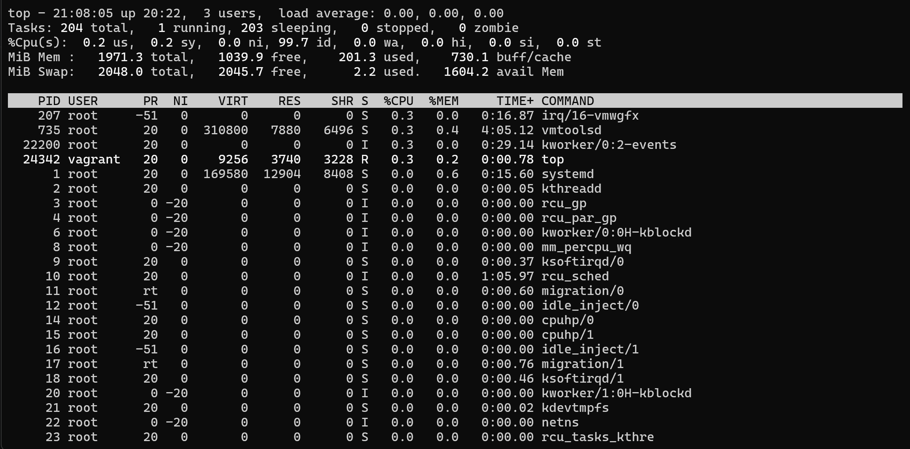

#### **Дешифриране на системното резюме (Горната част)**
Използваме реалния изход от нашия сървър:

* **`load average: 0.00, 0.00, 0.00`**: Системата е в пълен покой през последните 1, 5 и 15 минути.
* **`Tasks: 204 total, 1 running, 203 sleeping`**: Имаме 204 процеса, от които само 1 работи активно, а останалите чакат събитие.
* **`%Cpu(s)` разбивка:**
    * **`us` (User):** Вашият код и приложения.
    * **`sy` (System):** Времето на ядрото (Kernel).
    * **`id` (Idle):** Свободният ресурс (при нас е 99.7% – огромен резерв).
    * **`wa` (I/O Wait):** **Критично!** Процесорът чака диска. Ако е над 10%, имате проблем с хардуера или бавна мрежа.
    * **`st` (Steal Time):** Важно за Cloud (overselling). Времето, "откраднато" от хоста за други виртуални машини.
* **`MiB Mem` & `MiB Swap`:** * **`free`**: Чисто свободната памет.
    * **`buff/cache`**: Памет, заета от ОС за по-бърз достъп до диска.
    * **`avail Mem`**: Реалната памет, достъпна за нови приложения (най-важното число тук).


#### **Дешифриране на колоните (Долната част)**
Ще разгледаме само тези, които виждате в таблицата:

* **PID**: Уникален идентификатор на процеса (нужен за `kill`).
* **USER**: Кой потребител е стартирал процеса (напр. `root`, `vagrant`).
* **PR & NI**: **PR** е реалният приоритет за ядрото. **NI** (Nice) е нашата намеса (-20 до +19).
* **VIRT (Virtual)**: Всичко, което процесът е "поискал" (вкл. споделени библиотеки).
* **RES (Resident)**: **Най-важното!** Реалната RAM памет, която процесът заема в момента. Винаги гледайте RES за истинската консумация.
* **SHR (Shared)**: Памет, споделена с други процеси.
* **S (Status)**: 
    * **R** (Running): Работи в момента или чака в опашката за изпълнение.
    * **S** (Sleeping): Чака настъпването на дадено събитие (повечето процеси са тук).
    * **D** (Uninterruptible Sleep): Критично – чака I/O и не може да бъде прекъснат.
    * **T** (Stopped/Traced): Процесът е спрян (паузиран) чрез сигнал (напр. `Ctrl+Z`) или от дебъгер.
    * **Z** (Zombie): Процес "зомби" - завършил е, но все още е в таблицата с процеси.
    * **I** (Idle): Използва се за ядра (kernel threads), които са в покой и не хабят ресурси.
* **%CPU**: Натоварване на процесорното ядро.
* **%MEM**: Процент от общата RAM (базиран на RES).
* **TIME+**: Общото време, през което процесът е ползвал CPU от старта си.
* **COMMAND**: Името на програмата или командата.

#### **Интерактивни команди (Shortcut-и)**
Докато `top` е отворен, можете да натиснете:
* **`M`**: Сортиране по памет (**%MEM**).
* **`P`**: Сортиране по процесор (**%CPU**).
* **`1`**: Показва натоварването на всяко ядро поотделно.
* **`k`**: Убиване на процес директно от интерфейса.
* **`c`**: Показва пълния път на стартираната команда.

> **Важно:** Преди да обвините софтуерен бъг, винаги поглеждайте стойностите на **`sy`** и **`wa`**. 
> * Ако **`sy`** е високо -> проблемът може да е в драйвер или системни повиквания.
> * Ако **`wa`** е високо -> проблемът е в инфраструктурата (бавен диск или мрежа).
> 
> Често проблемът е в инфраструктурата, а не в самия код.

#### **Специфични стартиращи команди (Филтриране и Режими)**

Понякога не искаме да гледаме всичко, а само конкретна част от системата. Ето как да стартирате `top` с параметри:

* **`top -u vagrant`**: Фокусираме се само върху процесите на потребителя `vagrant`. Всички системни процеси на останалите потребители ще бъдат скрити.
* **`top -d 10`**: Променяме интервала на опресняване на **10 секунди** (по подразбиране е 3.0 сек). Полезно е, ако искате да наблюдавате системата по-спокойно, без числата да "скачат" постоянно.
* **`top -p [PID]`**: Следим само конкретен процес по неговия идентификационен номер (PID). Можете да следите и няколко процеса едновременно, разделени със запетая (напр. `top -p 1234,5678`).
* **`top -n 10 -b > top_report.txt` (Batch mode)**: 
    * Този режим е "злато" за автоматизация. 
    * Командата изпълнява точно **10 опреснявания** (`-n 10`) в текстов формат (`-b` за batch) и записва резултата директно във файл. 
    * Използвайте го за създаване на автоматизирани отчети или за логове, които да изпратите на колеги за анализ.

### 1.3. Модерният стандарт: `htop`

Ако `top` е класиката, то `htop` е модерният стандарт. Той не просто показва данни, а ни позволява да управляваме системата в реално време, без да излизаме от интерфейса.

**Пример за изход при изпълнение на htop в node1:**

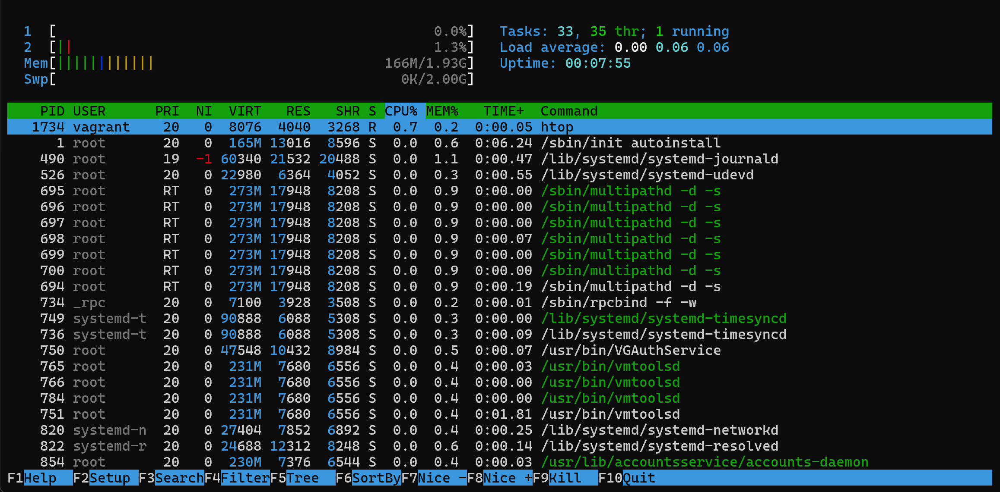

#### **Инсталация (за нашите два сървъра)**
Тъй като `htop` често не е инсталиран по подразбиране, трябва да го добавим:

* **На node2 (Rocky Linux):**
    ```bash
    sudo dnf install epel-release -y
    sudo dnf install htop -y
    ```
* **На node1 (Ubuntu):**
    ```bash
    sudo apt update
    sudo apt install htop -y
    ```

#### **Разчитане на цветните индикатори**
Първото нещо, което виждате горе, са лентите за всяко CPU ядро. Цветовете имат значение:

* **🟦 Синьо:** Процеси с нисък приоритет (low priority/nice).
* **🟩 Зелено:** Нормални потребителски процеси.
* **🟥 Червено:** Системни процеси (kernel). Ако видите много червено, значи ядрото се бори с нещо (често драйвери или мрежа).
* **Лентата за Mem (памет):** Показва веднага колко е реално заета и колко е кеш – отново в различни цветове.

#### **Специфични стартиращи команди**

#### 1. Контрол на опресняването: `htop -d 100`
По подразбиране `htop` се обновява много бързо. С флага `-d` (delay) задаваме интервала в **десети от секундата**. Тук `100` означава **10 секунди**.
* **Кога е полезно?** Когато имате хиляди процеси и искате да прочетете данните спокойно, без те да "скачат" постоянно, или когато искате да намалите собствения товар, който `htop` генерира върху много слаба машина.

#### 2. Дървовиден изглед: `htop -t` (или клавиш `F5`)
За вас като програмисти това е най-важният изглед. Флагът `-t` (tree) показва кой процес е родител и кои са неговите деца.

Ако вашият Java или Python сървър "избълва" 50 подпроцеса, в обикновения списък те ще са разхвърляни. В дървовидния изглед виждате точно кой процес е създал останалите. Това помага да разберете дали имате **Memory Leak** в основното приложение или в някой конкретен Worker.

#### **Функционални клавиши (Долният ред)**
`htop` е изключително удобен заради бързите си преки пътища:

* **F3 (Search) / F4 (Filter):** Можете веднага да филтрирате само вашите процеси (например пишете `python` или `node`).
* **F6 (Sort By):** Можете бързо да превключите сортиране по **%MEM** или **I/O Priority**.
* **F9 (Kill):** Вместо да търсите PID и да пишете `kill -9` в друг терминал, просто избирате процеса и го прекратявате оттук. Това спестява критично време.

> **Забележка:** `htop` не е част от стандартния пакет на всяка дистрибуция (за разлика от `top`), но е задължителен инструмент за всеки Engineer. Той комбинира функционалността на `ps`, `top` и `kill` в едно красиво и интуитивно табло.

### 1.4. Детайлна статистика по ядра: `mpstat`

`mpstat` (съкратено от **Multi-Processor Statistics**) ни позволява да получим информация за всяко ядро поотделно. В модерните системи е често срещано едно ядро да е натоварено на 100% (например от лошо написан еднонишков скрипт), докато останалите ядра почиват. `mpstat` е инструментът, който разкрива този дисбаланс.

#### **Инсталация**
Командата е част от пакета `sysstat`:
* **Node 1 (Ubuntu):**  
    ```bash
    sudo apt install sysstat -y
    ```
* **Node 2 (Rocky):** 
    ```bash
    sudo dnf install sysstat -y
    ```

#### **Начини на използване**

#### 1. Основен преглед: `mpstat`
Ако стартирате командата без параметри, тя показва средната статистика за всички ядра (отбелязани като **all**) от момента на стартиране на системата до сега.

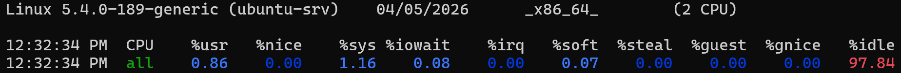

#### 2. Режим за диагностика: `mpstat 2 3` (Интервал и Брой)
Това е най-полезният режим. Тук казваме на системата: *"Давай ми отчет на всеки **2 секунди**, общо **3 пъти**"*. Така виждате динамиката в реално време и можете да "хванете" кратки пикове в натоварването, които `uptime` би пропуснал.

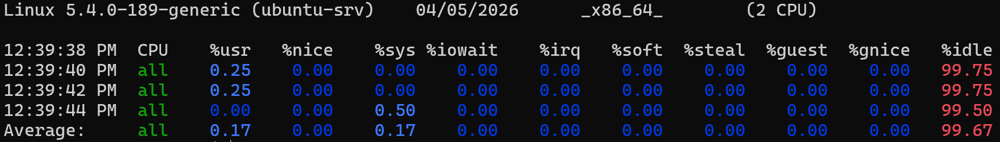

#### 3. Разбивка по ядра: `mpstat -P ALL`
Използвайте флага `-P ALL`, за да видите индивидуална статистика за всяко ядро (**CPU 0**, **CPU 1** и т.н.). 

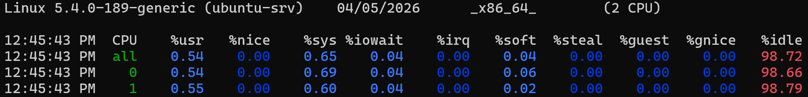

> **Важно:** Използва се за проверка дали товарът е равномерно разпределен. Ако CPU 0 е на 100%, а CPU 1 е на 0%, имате софтуер, който не поддържа многонишковост (multi-threading).

#### **Дешифриране на метриките (Важно за LPIC-2)**
Колоните в `mpstat` са подобни на тези в `top`, но ни дават по-дълбок поглед върху здравето на процесора:

* **`%usr` / `%sys` / `%idle`**: Познатите ни показатели за потребителски, системни процеси и свободен ресурс.
* **`%iowait`**: Времето, в което CPU е стояло празно, чакайки отговор от диска.
* **`%irq` / `%soft`**: Това е разбивката на прекъсванията. 
    * **`%irq`**: Хардуерни прекъсвания (директна комуникация с мрежови карти, дискове и т.н.).
    * **`%soft`**: Софтуерни прекъсвания (обработка на опашки от пакети и задачи на ниско ниво).
    > **Важно:** Ако сумата от двете е висока, имате проблем с драйвер или мрежово претоварване.
* **`%gnice`**: Време, прекарано в работа на виртуални процесори (често се вижда, ако хоствате виртуални машини).
* **`%steal`**: Важно за Cloud! Показва дали физическият хост ви "краде" процесорно време за други съседи.

#### **Автоматизация и JSON**
`mpstat` има мощния флаг **`-o JSON`**. Това е идеалният начин да вградим мониторинг на процесорните ядра в наши собствени софтуерни инструменти или да изпращаме данните към графични табла като **Grafana** за визуализация на живо.

### Обобщениe
Вече имате пълния набор от инструменти за CPU диагностика:
> 1. **`uptime`** за бърза снимка.
> 2. **`top` / `htop`** за интерактивно управление.
> 3. **`mpstat`** за дълбока статистика по ядра.

## 2. Мониторинг на паметта (Memory)

### 2.1. Анализ с `free`

Когато софтуерът ви започне да "гърми" с грешка **Out of Memory (OOM)**, първата ви спирка е командата `free`. Тя ни дава моментна снимка на цялата памет – физическа, виртуална и кеширана.

**Пример за изход при изпълнение на free в node1:**

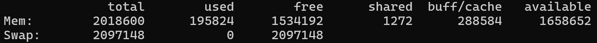

#### **Команди за проверка:**
* **`free -h`**: (Human-readable) Превръща числата в GB и MB. Винаги я ползвайте за бърза проверка, за да не се губите в хиляди цифри.
* **`free -s 1`**: Обновява информацията на всяка секунда. Идеално е да я оставите отворена в един терминал, докато в друг тествате тежък скрипт, за да видите как паметта "изчезва" в реално време.

#### **Ключови показатели (Какво ни казват колоните?):**

1. **total**: Пълният капацитет, с който разполага машината.
2. **used**: Паметта, която в момента е "заключена" от вашите приложения.
3. **free**: Напълно празна памет. (В Linux малкото `free` не е проблем, а признак, че системата работи ефективно).
4. **shared**: Памет, която се използва от повече от един процес едновременно.
5. **buff/cache**: Вашата "скрита" резерва. Това са файлове, които Linux държи в паметта за бързина, но ще изхвърли веднага, ако на вашето приложение му потрябва място.
6. **available**: **Най-критичното число!** Това е реалният отговор на въпроса: „Колко още памет мога да ползвам, преди сървърът да забие?“.

#### **Редът Swap**
Ако видите, че стойността в **used** на реда **Swap** започне да расте, значи сте в опасната зона. Дискът започва да имитира памет, което води до стократно забавяне на всяка операция.

### 2.2. Статистика на виртуалната памет: `vmstat`

`vmstat` (Virtual Memory Statistics) не просто показва числа, а ни дава пълна картина за процесите, паметта, swap-а, входа/изхода (I/O) и активността на процесора – всичко това в един ред. Използваме го най-вече, за да разберем дали системата "трашва" (thrashing) – състояние, при което тя постоянно прехвърля данни към диска и обратно, вместо да работи.

**Пример за изход при изпълнение на vmstat в node1:**

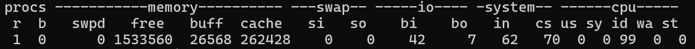

#### **Дешифриране на изхода (Групи колони)**

Когато стартирате `vmstat`, информацията е разделена на няколко критични зони:

**1. procs (Процеси)**
* **`r` (running):** Процеси, които работят или чакат ред за CPU. Ако това число е по-голямо от броя на ядрата ви (проверени с `nproc`), имате опашка.
* **`b` (blocked):** Процеси в "uninterruptible sleep". **Критично!** Те обикновено чакат за бавна дискова операция (I/O).

**2. memory (Памет)**
* **`swpd`**: Използвана виртуална памет (swap).
* **`free`**: Напълно свободна физическа памет.
* **`buff / cache`**: Памет, заета за временни хранилища и системен кеш.

**3. swap (Най-важната част за диагностика!)**
* **`si` (swap-in):** Памет, която се чете от диска обратно в RAM.
* **`so` (swap-out):** Памет, която се записва на диска, защото RAM е свършила.
> **Забележка:** Ако `si` и `so` са постоянно над нула, системата ви е в беда. Вашият код ще работи хиляди пъти по-бавно, защото дискът не може да замени скоростта на RAM.

**4. io (Input/Output)**
* **`bi` (blocks in):** Четене от дискови устройства.
* **`bo` (blocks out):** Запис към дискове.

**5. system**
* **`in` (interrupts):** Брой хардуерни прекъсвания на секунда.
* **`cs` (context switches):** Колко често процесорът превключва от един процес на друг. Високи стойности означават прекалено много конкурентни задачи.

#### **Специфични стартиращи команди**

* **`vmstat 2 3`**: Означава: "Дай ми 3 отчета през 2 секунди". 
    * *Важно:* Първият ред винаги е средната стойност от момента на стартиране на системата (uptime). 
    * Вторият и третият ред са тези, които ни показват **реалната динамика в момента**.

* **`vmstat -S m`**: По подразбиране `vmstat` работи в килобайти. С флага `-S m` превръщаме всичко в **Мегабайти**, което е много по-лесно за бърз човешки анализ.

* **`vmstat -s`**: Показва огромна таблица с обобщени статистики за паметта от старта на системата до сега (брой събития, страници и т.н.).

> **Забележка:** Ако видите високо число в колона `b` (blocked) едновременно с високи стойности в `wa` (от командата `top`), проблемът със сигурност е в бавния диск, а не в процесора.

## Разбиране на процесите

### Командата `ps` (Process Status)

Командата `ps` е основният инструмент за "снимка" на процесите - дава статичен, но изключително подробен отчет за това кой какво прави в системата точно в този момент.

**Пример за изход при изпълнение на ps в node1:**

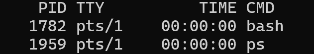

#### **Анализ на паметта: VSZ срещу RSS**
За да разберем кой консумира паметта, използваме `ps`. Важно е да правите разлика между:

* **RSS (Resident Set Size): "Истинската" памет.** Показва колко точно байта от процеса се намират в RAM платките в момента.
    * **Включва:** Код, данни, Stack, Heap и споделени библиотеки (които са в RAM).
    * **Не включва:** Всичко, което е отишло в Swap.
* **VSZ (Virtual Memory Size): "Обещаната" памет.** Включва всичко, до което процесът има достъп.
    * **Включва:** Всичко в RSS + паметта в Swap + заделена, но неизползвана памет + библиотеки на диска.

#### **Практически режими на работа**

#### 1. Пълен списък на всичко: `ps -ef`
Това е стандартът за бърза проверка.
* **`-e`**: Всички процеси.
* **`-f`**: Пълен формат (показва PID, PPID, време на стартиране).

Това ни позволява да видим "родословното дърво" (**PPID**) – кой процес е стартирал вашия скрипт.

#### 2. Подробна статистика и състояния: `ps -ely`
* Флагът **`-l`** (long) добавя колоните RSS и SZ.
* Флагът **`-y`** променя мерните единици в **килобайти** (вместо страници) – много по-лесно за четене.

#### **Разчитане на "Системните обитатели"**
В изхода на `ps -ely` ще забележите, че колоните **RSS** и **SZ** за почти всички процеси под `systemd` са **0**. Това не е грешка, а индикация за **Kernel Threads** (нишки на ядрото). Те живеят изцяло в ядрото, за да управляват хардуера.

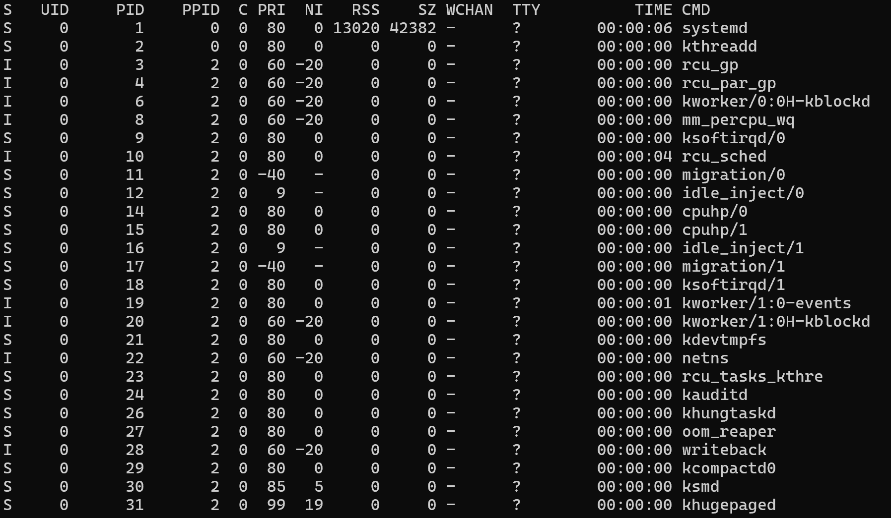

* **PID 1 (systemd):** "Бащата" на всички процеси в потребителското пространство. Един от малкото тук с реална RSS. Управлява услугите на приложенията.
* **PID 2 (kthreadd):** "Бащата" на всички нишки на ядрото. Ако видите процес с **PPID 2**, значи това е системен работник на Linux ядрото.
* **rcu_sched / rcu_gp:** Критични за синхронизацията в ядрото. Ако спрат, системата замръзва.
* **kworker:** Общите работници на ядрото. Вършат всичко – от управление на прекъсвания до писане на данни по дисковете.

#### **Приоритети: Как Linux решава кой е по-важен?**

* **PRI (Priority):** Колкото по-малко е числото, толкова по-висок е приоритетът.
* **NI (Nice):** Стойност **-20** (егоистични процеси като `rcu_gp`) означава: *"Аз съм изключително важен, дай ми ресурси веднага"*. Потребителските процеси обикновено започват с **0**.
* **Стойност `-` в NI:** При процеси като `migration/0` виждате тире. Това са **Real-Time** процеси. Ядрото ги управлява със специален приоритет над всичко останало.


#### **Допълнителни диагностични колони**

* **WCHAN (Waiting Channel):** Показва името на функцията в ядрото, която процесът чака. 
    * `futex` – процесът чака друга нишка.
    * `block_dev` – чака диска.
* **Нишки (Threads): `ps -eLf`**
    * Показва **LWP** (Lightweight Process ID) – идентификатор на самата нишка.
    * Показва **NLWP** – общ брой нишки в този процес.

#### **Речник на състоянията (Колона S)**

1.  **R (Running):** В процесора или чака на опашката за него.
2.  **S (Sleeping):** Чака събитие (потребителски вход, таймер).
3.  **D (Disk sleep):** Блокиран от I/O (най-лошото за производителността).
4.  **T (Stopped):** Спрян чрез сигнал (напр. `Ctrl+Z`).
5.  **Z (Zombie):** Приключил процес, чакащ родителя си да го "изчисти".
6.  **I (Idle):** Нишки на ядрото в покой. Не ги бъркайте със състояние 'S' – те не консумират никакви ресурси, докато не се появи работа.

### Командата `pstree` (Процесното родословно дърво)

Командата `pstree` е визуалният еквивалент на родословно дърво за нашите процеси и ни помага да разберем кой процес е "родител" (**Parent**) и кои са неговите "деца" (**Children**).

**Пример за изход при изпълнение на pstree в node1:**

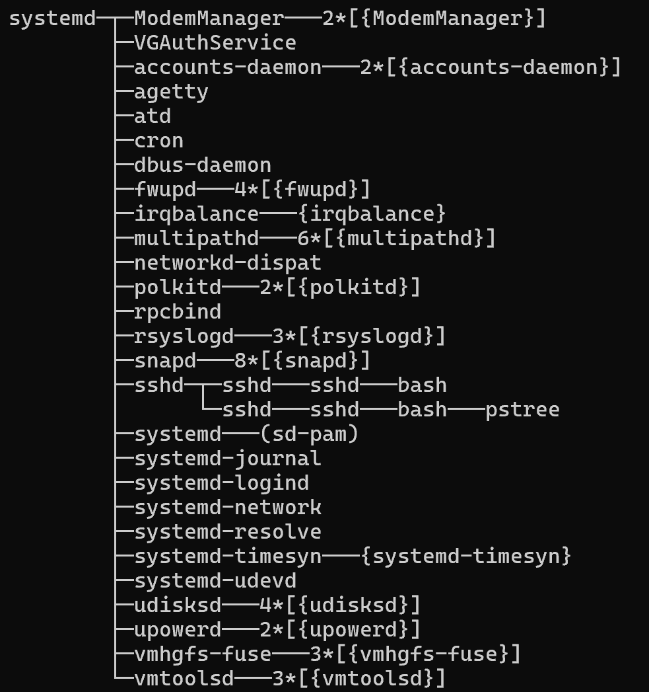

#### **Визуална структура**
Всичко започва от **systemd** (корена на дървото). От него се разклоняват всички услуги. 
* Ако видите име в скоби и число пред него (напр. `5*[kworker]`), това означава, че процесът е създал няколко идентични копия на себе си. 
* Това е най-бързият начин да разберете структурата на вашата операционна система „с един поглед“.


#### **Ключови флагове за работа**

#### 1. Идентификация на процеси: `pstree -p`
Това е най-често използваната комбинация. Тя добавя **Process ID (PID)** в скоби до всяко име. 

>**Забележка:** Ако трябва да убиете цяла група процеси, първо гледате тук кой е главният родител, за да не ги "ловите" един по един с `kill`. Убиването на родителя често почиства и неговите деца.

#### 2. Дебъгване на параметри: `pstree -a`
Много важно за диагностика! Този флаг показва не само името на процеса, но и **пълната команда с параметрите**, с които е стартиран. С други думи, веднага виждате дали вашият скрипт е зареден с правилния конфигурационен файл, порт или обкръжение (environment).

#### 3. Изолиране на конкретно дърво: `pstree -a [PID]`
Ако сървърът ви има 500 процеса, стандартният изход ще напълни екрана с "шум". Използвайте PID на основния процес на вашето приложение, за да изолирате само неговата йерархия. Така веднага виждате колко нишки или подпроцеси е генерирало конкретното приложение, без да се губите в останалата част от системата.

#### **Нишки срещу Процеси в `pstree`**

В изхода понякога ще видите имена в **къдрави скоби `{ }`**. Това са **нишки (threads)**. За разлика от подпроцесите, нишките споделят една и съща памет с родителския процес. Програмистите на Java, Python и Go често ще виждат това, тъй като техните приложения са силно мултинишкови (multithreaded).

> **Пример за анализ:** Ако видите, че вашият уеб сървър има 1 родителски процес и 50 нишки в къдрави скоби, вие знаете, че това е едно приложение, което обработва 50 паралелни заявки, а не 50 отделни програми.

### Командата `lsof` (LiSt Open Files)

В Linux всичко е файл – хардуерът, директориите, процесите и дори мрежовите сокети. Командата `lsof` е "детективът", който ни показва кои процеси държат тези файлове отворени. 

**Пример:** Опитвате се да изтриете директория или да демонтирате (umount) USB флашка, но системата ви казва: *Device or resource busy*. Как разбирате кой процес я блокира? **Отговорът** е `lsof`.


#### **Ролята на root и правата за достъп**
По подразбиране ядрото забранява на един потребител да "наднича" в ресурсите на друг.
* **Без `sudo`:** `lsof` ще ви покаже само файловете, отворени от вашите собствени процеси (напр. вашия bash, vi или ssh клиент).
* **Със `sudo`:** Вие действате като **root**. Имате право да виждате *File Descriptors* на абсолютно всеки процес – от системните нишки на ядрото до уеб сървъра, работещ под друг потребител.

**Пример за изход при изпълнение на sudo lsof в node1:**

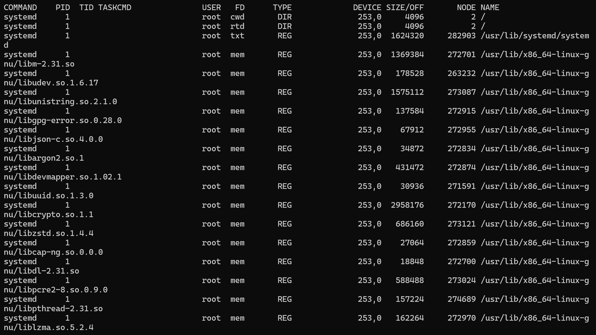

#### **Практически филтри и логически оператори**

| Флаг | Значение | Пример |
| :--- | :--- | :--- |
| **`-u`** | Потребител | `sudo lsof -u vagrant` (Всичко, което потребителят vagrant прави) |
| **`-c`** | Команда | `sudo lsof -c vim` (Всички файлове, отворени от vim) |
| **`-t`** | Terse (кратък) | `sudo lsof -t -u vagrant` (Връща само PID-овете – за скриптове на потребителя vagrant) |
| **`-a`** | **AND** оператор | `sudo lsof -u vagrant -c bash -a` (Само процеси на vagrant, които СА bash) |

> **Важно:** По подразбиране `lsof` използва **OR**. Ако искате процесите на конкретен потребител, които едновременно с това са и конкретна команда, трябва задължително да добавите **`-a`**.

#### **Изтрит, но зает файл (Ghost Files)**
Често се случва дискът ви да е пълен, вие изтривате голям log файл, но `df` все още показва 0% свободно място. Това се случва, защото някой процес все още държи файла отворен. Докато не убиете този процес, ядрото няма да освободи мястото на диска.

#### **Демонстрация (Практическо упражнение)**:
#### 1. Създаваме файл: `dd if=/dev/zero of=ghost_file.txt bs=1M count=100`
#### 2. Отваряме го: `less ghost_file.txt` (Оставете го отворен в този терминал!)
#### 3. Трием го в нов терминал: `rm ghost_file.txt`

**Забележка:** Файлът изчезна от `ls`, но мястото на диска НЕ се освободи!

#### 4. Диагностика: `sudo lsof / | grep deleted`

**Резултат:** Ще видите ред, в който пише `less` и пътя до файла с маркер **(deleted)**. 

**Извод:** Ако вашият софтуер пише логове и дискът се напълни, триенето на файла чрез `rm` няма да помогне, докато софтуерът не бъде рестартиран или не затвори дескриптора.

#### **Мрежова диагностика с `lsof -i`**
В Linux мрежовите сокети също са файлове. С `lsof -i` можем да видим точно кои процеси "говорят" с външния свят.

* **`sudo lsof -i`**: Всички мрежови връзки.
* **`sudo lsof -i tcp`**: Само TCP трафик (Web, SSH).
* **`sudo lsof -i tcp | grep LISTEN`**: Всички "отворени врати" (портове), които чакат връзка.
* **`sudo lsof -i :80`**: Кой процес заема порт 80? (Идеално, ако не можете да пуснете уеб сървър).
* **`sudo lsof -i4` / `sudo lsof -i6`**: Филтриране по IPv4 или IPv6.

#### **Работа с директории и отдалечени системи**

* **`sudo lsof +D /home`**: Използвайте това, когато искате да проверите всичко вътре в дадена папка (в случая /home). Командата ще претърси рекурсивно всяка подпапка и всеки файл в нея.

    >**Пример за употреба:** Най-често, когато се опитвате да изключите външен диск или флашка, но системата ви казва, че "ресурсът е зает". Подавате пътя до диска и веднага виждате кой процес го "държи" и не ви позволява да го откачите.

* **`sudo lsof +d /proc`**: Използвайте това, когато искате да проверите само съдържанието на самата папка (в случая /proc), без да губите време да влизате в нейните хиляди подпапки.

    >**Важно:** Спестява време и ресурси на сървъра, когато ви трябва само повърхностна проверка на системни директории, които са претъпкани с подпапки.

* **`sudo lsof -N`**: Специализиран флаг за **NFS** (Network File System). Ако мрежата прекъсне и сървърът ви "замръзне", докато се опитва да прочете файл от друг компютър, тази команда ще ви покаже точно кои програми са зациклили и чакат отговор от мрежата.

    >**Забележка:** Тук не посочвате конкретна папка, защото флагът автоматично намира всички процеси, които работят със споделени папки по мрежата (NFS).

> **Важно:** Запомнете, че `lsof` е незаменима за откриване на **file descriptor leaks** и за мрежова сигурност. Тя комбинира информация за процесите с информация за файловата система.

## 3. Мониторинг на дисковия I/O и Мрежовия трафик

В тази секция разглеждаме как да проследяваме входно-изходните операции (Input/Output) и как дисковете влияят на общата производителност на сървъра.

### 3.1. Командата `iostat`

Командата `iostat` (Input/Output Statistics) се използва за наблюдение на натоварването на системните устройства за входно-изходни операции. Тя е безценна за откриване на тесни места (bottlenecks) в дисковата подсистема.

#### **Инсталация**
За да използвате `iostat`, трябва да инсталирате пакета `sysstat`:

* **На node1 (Ubuntu):**
    ```bash
    sudo apt update
    sudo apt install sysstat -y
    ```

* **На node2 (Rocky Linux):**
    ```bash
    sudo dnf install sysstat -y
    ```

**Пример за изход при изпълнение на iostat в node1:**

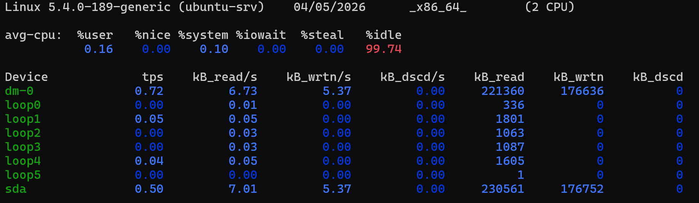

> **Важно:** При стартиране без параметри, `iostat` дава средна статистика от момента, в който системата е била стартирана (**boot**) до сега.


#### **CPU статистики (`avg-cpu`)**
Тези метрики показват как процесорът изразходва времето си спрямо входа и изхода на данни:

* **%user**: Време, прекарано в приложения (потребителско ниво).
* **%nice**: Време за процеси с променен приоритет (*nice priority*).
* **%system**: Време, прекарано в ядрото (*kernel*). Висок процент тук при голям трафик може да означава проблеми с драйвери.
* **%iowait**: Най-важната метрика. Показва времето, в което процесорът е бил свободен (*idle*), но е чакал завършване на дискова операция. Ако е висока, дисковете са вашето тясно място.
* **%steal**: Време, "откраднато" от хипервайзора (важно при виртуални машини).
* **%idle**: Време, в което процесорът не прави нищо и не чака дискове.

#### **Статистики на устройствата (`Device`)**
Тези метрики описват интензивността на работа на вашите дискове или дялове (sda, dm-0 и т.н.):

* **tps (Transactions Per Second)**: Броят заявки за четене или запис към диска за секунда. Повече заявки означават по-натоварен диск.
* **kB_read/s**: Средно количество данни, прочетени от диска за секунда.
* **kB_wrtn/s**: Средно количество данни, записани на диска за секунда.
* **kB_dscd/s**: Скорост на "изхвърляне" на данни (*discard/trim*) - важно за SSD дискове.
* **kB_read / kB_wrtn / kB_dscd**: Общите суми (*total*), отчетени от стартирането на системата до момента.

> **Забележка:** Гледайте колоната **tps** – ако имаме високи числа тук, дискът работи здраво. Колоните **kB_read/s** и **kB_wrtn/s** ни казват реалната скорост. Ако искате да разберете дали дискът е тясното място за вашата база данни, това е мястото, където да проверите.

#### **Разширени метрики**
За детайлна професионална диагностика използвайте `iostat -x`.

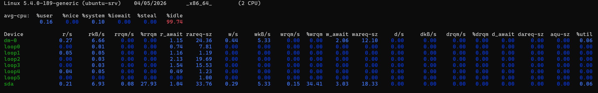

Така се появяват най-критичните показатели:

* **r/s | w/s | d/s**: Брой заявки за четене, запис или изхвърляне, изпратени към устройството за секунда.
* **rrqm/s | wrqm/s**: Колко заявки са били „слети“ (*merged*) от операционната система, преди да бъдат пратени към хардуера за по-висока ефективност.
* **%rrqm | %wrqm**: Процентът на успешно слетите заявки.
* **r_await | w_await | d_await**: Средното време (в милисекунди), което е отнело на една заявка за четене, запис или изхвърляне да бъде обслужена. **Това е най-точният индикатор за латентност.**
* **aqu-sz (Average Queue Size)**: Средната дължина на опашката от заявки. Ако това число расте, дискът не успява да обработи данните навреме.
* **%util**: Процентът време, през който дискът е бил зает с работа. Ако е близо до **100%**, дискът е на предела на възможностите си.

#### **Полезни флагове за форматиране и диагностика**

В реална работна среда често нямаме време да пресмятаме байтове в главата си или да филтрираме излишна информация. Ето как да направите `iostat` по-ефективен:

* **Четливост и време:**
    * **`-h` (human-readable):** Преобразува стойностите в мегабайти (MB) и гигабайти (GB), за да се разчитат лесно от човек.
    * **`-t` (timestamp):** Добавя точно клеймо с дата и час към всеки отчет. **Важно:** Винаги ползвайте `-t`, когато записвате логове за по-късен анализ, за да знаете кога точно е настъпило пиковото натоварване.
  
* **Автоматизация и експорт:** **`-o JSON`** извежда данните в структуриран JSON формат. Това е безценно за програмисти, които пишат собствени скриптове за мониторинг или искат да изпратят данните към външни системи като **ElasticSearch** или **InfluxDB**, без да ползват сложни инструменти за текстова обработка.
  
* **Фокусиране върху конкретно устройство:** Използвайте `iostat -p [device]`, за да се фокусирате само върху конкретен диск или дял. На сървъри с много дискове това помага да изолирате проблема – дали се бави системният диск или масивът с данни (напр. `iostat -p sda`).

* **Изолиране на компоненти:**
    * **`-c` (CPU):** Показва само процесорната статистика. Полезно, ако подозирате софтуерно натоварване.
    * **`-d` (Disk):** Изключва процесора и показва само дисковете. Използвайте го, за да наблюдавате единствено пропускателната способност на сториджа.
  
* **Мониторинг на конкретна папка:** Изпълнете `iostat -f [dir]`, за да видите статистиката за конкретна директория (напр. `iostat -f /var/log`). Ако подозирате, че интензивното писане на логове бави системата, тук ще видите активността точно върху тази част от файловата система.


#### **Мониторинг в реално време**

Това е най-важният аспект при активна диагностика. Изпълнението на `iostat 1 3` означава: **"Дай ми отчет на всяка 1 секунда, общо 3 пъти"**.

> **Важно:** Първият отчет на `iostat` винаги е средната стойност от стартирането на системата (boot) и често е подвеждащ за текущ проблем. За реална диагностика **винаги гледайте следващите отчети** (втория, третия и т.н.), защото те показват какво се случва в системата в този конкретен момент.

### 3.2. Мрежови инструменти: `ss`, `netstat` и `iptraf`

Когато дисковете са наред, но системата все още бави, проблемът често е в мрежовия трафик.

* **`ss` (Socket Statistics):** Забравете стария `netstat` и свиквайте със `ss`. Той е директен наследник, който извлича информацията директно от ядрото и е много по-бърз при системи с хиляди активни връзки.
    * **`ss -tln`**: Показва кои TCP портове "слушат" (listening) за входящи връзки в момента.
* **`iptraf-ng`**: Ако искате графика в реално време на трафика през интерфейсите, това е вашият инструмент. Той е идеален за откриване на конкретни IP адреси, които "изяждат" целия капацитет на локалната мрежа.

### 3.3. Специализирани статистики: `cifsiostat` и `nfsiostat`

В корпоративна среда сървърите често работят с отдалечени мрежови хранилища. Тези инструменти помагат да разберете дали забавянето е в самото приложение, или в мрежовата латентност до сториджа.

#### **cifsiostat - Статистика за Windows споделяния (SMB/CIFS)**
Използва се главно, когато Linux сървърът е монтирал папки от Windows машини или Samba сървъри.
* **Какво следи:** Колко данни се четат и записват през протокола CIFS.
* **Ключова команда:** `cifsiostat -h -m 1`
    * `-h`: Прави числата лесни за четене.
    * `-m`: Показва стойностите в MB/s.
    * `1`: Обновява информацията на всяка секунда.
> **Забележка:** Ако скриптът ви работи бавно върху споделена папка, пуснете това. Ако виждате ниски MB/s при висок **%iowait**, проблемът е в мрежата или в отдалечения Windows сървър.

#### **nfsiostat - Статистика за NFS (Linux Network File System)**
NFS е стандартът за споделяне на файлове между Linux машини. Тази команда е "клонинг" на `iostat`, но за мрежови монтирания.
* **Какво ни показва:** Тя чете директно от системните файлове и дава информация за латентността (забавянето) и броя операции (RPC) към отдалечения сървър.
* **Примери:**
    * `nfsiostat 5 10`: Отчет на всеки 5 секунди, общо 10 пъти.
    * `nfsiostat -s`: Сортира изхода по **ops/s** (операции в секунда). Изключително полезно, за да видите кое мрежово монтиране натоварва системата най-много.

> **Важно:** Когато анализирате бавна система, винаги спазвайте тази последователност:
> 1. Проверете локалните дискове с **`iostat`**.
> 2. Проверете мрежовите дискове с **`nfsiostat`** или **`cifsiostat`**.


#### **Инсталация на необходимите инструменти**
За да имате достъп до всички тези команди, изпълнете:

* **На node1 (Ubuntu):**
    ```bash
    sudo apt update
    sudo apt install nfs-common sysstat iptraf-ng -y
    ```

* **На node2 (Rocky Linux):**
    ```bash
    sudo dnf install nfs-utils sysstat iptraf-ng -y
    ```

## Дългосрочен анализ със `sar` (System Activity Reporter)

Всички команди дотук (`top`, `ps`, `iostat`) ни показваха състоянието "тук и сега". Но какво се е случило в 3:00 ч. през нощта, когато сървърът е забавил? Тук на помощ идва `sar` - инструментът за исторически анализ.

> **Забележка:** **`sar`** е част от пакета `sysstat` и събира данни за системата денонощно в background-а.

### Активиране на "Черната кутия"

За да може `sar` да записва история, трябва да кажем на системата, че искаме да събираме данни и да стартираме фоновия процес (демон).

1. **Конфигурация (за Ubuntu/Debian):**
   Отворете файла за редактиране:
   `sudo nano /etc/default/sysstat`
   Променете стойността на `ENABLED="true"`.

2. **Стартиране и активиране:**
   `sudo systemctl enable --now sysstat`

3. **Ръчно записване на първи отчет:**
   Тъй като току-що сте го пуснали, архивните файлове все още са празни. Можете да накарате `sar` да направи запис веднага:
   `sudo /usr/lib/sysstat/sa1 1 1`

От този момент нататък, на всеки **10 минути** (стандартно), Linux ще записва състоянието на процесора, паметта и дисковете в директорията `/var/log/sysstat/`.

### Работа с исторически данни

Файловете в `/var/log/sysstat/` се именуват според деня от месеца (напр. `sa01` за първо число).

* **Преглед на натоварването за конкретен ден:**
  `sar -f /var/log/sysstat/sa01`

* **История на процесора (CPU):**
  `sar -u`

* **История на мрежовия трафик:**
  `sar -n DEV`

### Проверка в реално време
Въпреки че е за история, `sar` може да се ползва и за моментен мониторинг:
* `sar 1 5`: "Покажи ми 5 отчета на процесора през 1 секунда веднага."
* `sar -n DEV 1 3`: "Покажи ми мрежовия трафик в момента (3 отчета)."

## Обобщение

Вашата задача като системни администратори е да съпоставяте данните от всички инструменти, за да видите цялата картина:

1. **Ако `iowait` в `top` е висок** - проверете **`iostat`** за натоварени дискове. След това ползвайте **`lsof`** или **`iotop`**, за да намерите виновния процес.
2. **Ако видите висок `swap` във `vmstat`** - проверете **`ps`** или **`top`** за процеси с необичайно голям **RSS** (реална памет).
3. **Ако сървърът е блокирал през нощта** - отидете в архивите на **`sar`**, за да откриете тренда и да разберете дали е свършила паметта или е имало мрежова атака.

> **Важно:** Capacity Planning се прави със `sar`. Без история вие само гадаете. Със `sar` вие доказвате проблема с факти.