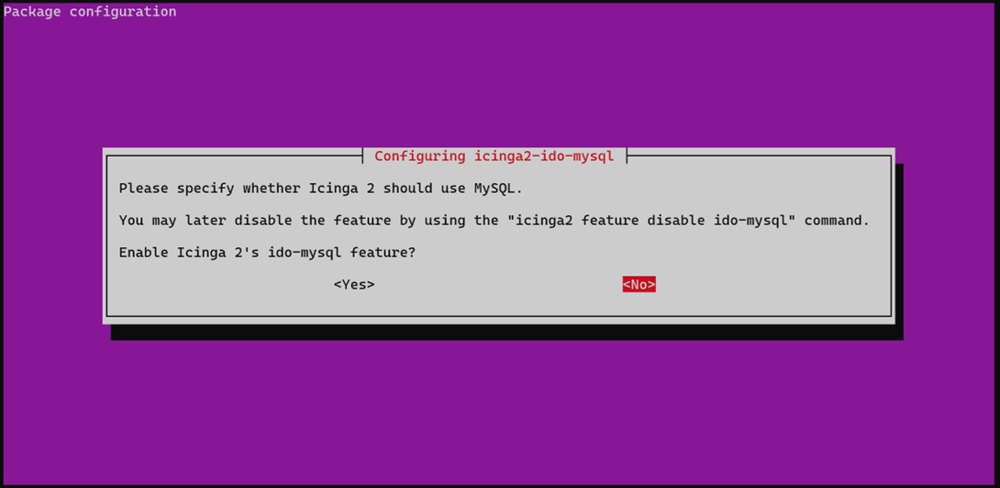

# Тема 200.2 - Предвиждане на бъдещи нужди от ресурси
 
## Icinga2: Мониторинг от ново поколение

**Icinga2** е мощна система за мониторинг с отворен код. Тя следи наличността на мрежови ресурси (сървъри, услуги, суичове), известява при проблеми и събира данни за производителност. Базирана е на опита от **Nagios**, но с модерна, обектно-ориентирана архитектура и силно **API**.

**Защо Icinga2 върху Ubuntu Server?**

В контекста на **LPIC-2**, тази комбинация е предпочитана заради:

* **Официална поддръжка:** Icinga поддържа собствени хранилища за Ubuntu, което гарантира бърза и стабилна инсталация чрез apt.

* **Стандартна конфигурация:** PHP и Apache модулите, нужни за Icinga, се интегрират лесно и предвидимо в Ubuntu среда.

* **Професионален стандарт:** Това е най-често срещаният модел в практиката, съчетаващ стабилността на Ubuntu с мощността на Icinga2.

### Стъпка 1: Инсталация на ядрото на Icinga 2
---

Първата стъпка от нашето упражнение е да вдигнем "сърцето" на мониторинг системата – `icinga2` демона. Това е софтуерът, който ще отговаря за изпълнението на проверките и управлението на логиката на мониторинга.

### 1. Подготовка на скрипта

За да автоматизираме процеса и да избегнем човешки грешки, ще създадем инсталационен скрипт в нашето локално хранилище.

1. Свържете се с в node1 и създайте директория `scripts` (ако не съществува):
   ```bash
   mkdir ./scripts
   cd ./scripts
   ```

2. Създайте нов файл с име install_icinga2_core.sh чрез текстовия редактор vim:
   ```bash
   vim install_icinga2_core.sh
   ```

3. Поставете вътре кода от скрипта **[install_icinga2_core.sh](./scripts/install_icinga2_core.sh)**.

4. Запишете и излезте (става чрез **:wq**).

### 2. Изпълнение
За да стартирате инсталацията, задайте права за изпълнение и стартирайте скрипта:
   ```bash
   chmod a+x install_icinga2_core.sh
   sudo ./install_icinga2_core.sh
   ```

### 3. Валидация
След приключване, проверете дали услугата е стартирана успешно:
   ```bash
   systemctl status icinga2
   ```

Статусът трябва да бъде **active (running)**.

Проверете инсталираната версия:
   ```bash
   icinga2 --version
   ```

### Стъпка 2: Инсталация на Monitoring Plugins
---

След като ядрото е инсталирано, трябва да добавим инструментите, които реално извършват проверките (check_disk, check_load, check_ping и т.н.). В света на Icinga/Nagios това са стандартните **Monitoring Plugins**.

### 1. Подготовка на скрипта

Ще използваме скрипт, който инсталира пакета с над 50 стандартни плъгина, необходими за базовия мониторинг на ресурсите (CPU, RAM, Disk).

1. Влезте в папката `scripts`:
   ```bash
   cd ./scripts
   ```

2. Създайте нов файл install_monitoring_plugins.sh:
   ```bash
   vim install_monitoring_plugins.sh
   ```

3. Поставете вътре кода от скрипта **[install_monitoring_plugins.sh](./scripts/install_monitoring_plugins.sh)**.

4. Запишете и излезте (**:wq**).

### 2. Изпълнение
Дайте права за изпълнение и стартирайте скрипта:

   ```bash
   chmod a+x install_monitoring_plugins.sh
   sudo ./install_monitoring_plugins.sh
   ```

### 3. Валидация (Къде са плъгините?)

В темата 200.2 (Diagnose) от LPIC-2 е важно да знаете къде физически се намират тези инструменти. Проверете съдържанието на директорията:

   ```bash
   ls -l /usr/lib/nagios/plugins/
   ```

Там трябва да видите файлове като check_disk, check_load, check_http и др.

>Важно: Всеки плъгин в Linux мониторинга работи на принципа на Exit Codes (Изходни кодове). Като програмисти знаете:
>*	0 (OK): Всичко е наред.
>*	1 (WARNING): Внимание, ресурсът е близо до лимита.
>*	2 (CRITICAL): Системата е в опасност!
>*	3 (UNKNOWN): Плъгинът не може да събере данни.
>
>Icinga2 просто чете този код и оцветява интерфейса в зелено, жълто или червено.

### Стъпка 3: Инсталация на MariaDB и конфигуриране на IDO Модул
---

За да може Icinga 2 да съхранява информация за събитията и да я предава към уеб интерфейса, ни е необходима база данни и модулът **IDO (Icinga Data Output)**.

### 1. Подготовка на скрипта

1. Влезте в папката `scripts`:
   ```bash
   cd ./scripts
   ```

2. Създайте файла setup_db_ido.sh:
   ```bash
   vim setup_db_ido.sh
   ```

3. Поставете вътре кода от скрипта **[setup_db_ido.sh](./scripts/setup_db_ido.sh)**.

4. Запишете и излезте (**:wq**).

### 2. Изпълнение
Задайте права за изпълнение и стартирайте скрипта:

   ```bash
   chmod a+x setup_db_ido.sh
   sudo ./setup_db_ido.sh
   ```

### 3. Процесът на сигурност (mysql_secure_installation)
По време на изпълнението, скриптът ще ви преведе през настройките за сигурност на MariaDB.

След последния въпрос (Remove test database?), ще бъдете попитани: 
* Reload privilege tables now? [Y/n]

Задължително изберете 'Y'. Това е командата, която казва на MariaDB: "Забрави старите правила и приложи новите веднага". Това е еквивалентът на `systemctl restart`, но за вътрешната памет на самата база данни.

### 4. "Тънкият момент" в графичния интерфейс (ncurses)
При инсталацията на пакета `icinga2-ido-mysql` ще се появи графичен интерфейс в терминала. Тук се взема най-важното администраторско решение:



На всички въпроси в този интерфейс изберете: **< No >**

>**Забележка:** Избираме "No", за да запазим пълния контрол върху конфигурацията и паролите, които скриптът задава ръчно.

### 5. Ръчно наливане на схемата

Тъй като отказахме автоматизацията, трябва сами да подготвим таблиците. Скриптът ще го направи вместо вас, но е важно да знаете командата:

   ```bash
   sudo mysql -u root -p icinga < /usr/share/icinga2-ido-mysql/schema/mysql.sql
   ```

### 6. Валидация

След като скриптът приключи, трябва да потвърдим, че връзката с базата данни е активна. 

>**Важно:** Командите на Icinga 2 изискват администраторски права. Ако ги изпълните без `sudo`, ще получите грешка "Operation not permitted".

1. Проверка на активните модули:

    ```bash
    sudo icinga2 feature list
    ```

    Трябва да видите `ido-mysql` в секцията Enabled features.

2. Проверка на системния статус:
    ```bash
    systemctl status icinga2
    ```

3. Проверка на log файла за грешки при свързване:
Ако модулът е активен, но има проблем с паролата в базата данни, ще го видите тук:
    ```bash
    sudo tail -n 20 /var/log/icinga2/icinga2.log
    ```

### Стъпка 4: Активиране на Icinga 2 REST API
---

За да може уеб интерфейсът да изпраща команди към ядрото (напр. да пускате проверки ръчно), трябва да активираме API модула.

### 1. Автоматична настройка

Icinga 2 има вградена команда, която генерира необходимите сертификати и конфигурационни файлове за сигурна връзка:

```bash
sudo icinga2 api setup
```

### 2. Прилагане на промените
След като сертификатите са генерирани, трябва да рестартираме демона, за да започне да слуша на порт 5665:

```bash
sudo systemctl restart icinga2
```

### 3. Валидация (Diagnose)
Проверете дали API-то работи и дали сървърът слуша на правилния порт:

```bash
sudo ss -tulpn | grep 5665
```

**Очакван резултат:** `tcp   LISTEN  0  4096  *:5665  *:* users:(("icinga2",pid=...,fd=...))`\
Това потвърждава, че ядрото на Icinga 2 слуша на порт 5665 и е готово да приема отдалечени команди през своя REST API.

### 4. API Потребител (За справка)
Командата api setup автоматично създава потребител root в директорията /etc/icinga2/conf.d/api-users.conf. Запишете си паролата от този файл, защото може да ви потрябва при финалната настройка в браузъра.

```bash
sudo cat /etc/icinga2/conf.d/api-users.conf
```

### Стъпка 5: Инсталация на Icinga Web 2
---

Icinga Web 2 се нуждае от собствена база данни, за да съхранява настройките на потребителите, техните предпочитания и права за достъп.

### 1. Подготовка и изпълнение на скрипта

Ще използваме [install_icinga_web.sh](../scripts/install_icinga_web.sh), който автоматизира инсталацията на уеб интерфейса и конфигурацията на втората база данни.

1. Влезте в папката `scripts`:
   ```bash
   cd ./scripts
   ```

2. Създайте файла `install_icinga_web.sh`:
   ```bash
   vim install_icinga_web.sh
   ```

3. Поставете вътре кода от скрипта **[install_icinga_web.sh](./scripts/install_icinga_web.sh)**.

4. Запишете и излезте (**:wq**).

### 2. Изпълнение
Задайте права за изпълнение и стартирайте скрипта:

   ```bash
   chmod a+x install_icinga_web.sh
   sudo ./install_icinga_web.sh
   ```

### 3. Работа със Setup Token
След изпълнение на скрипта, в терминала ще видите вашия **Setup Token**. Това е временният "ключ", с който ще влезете в браузъра за първи път.

*  Ако сте пропуснали да го видите - Използвайте командата:
   ```bash
   sudo icingacli setup token show
   ```

* Ако получите грешка (напр. "No such file or directory"): Просто генерирайте нов токен с:
   ```bash
   sudo icingacli setup token create
   ```

>**Забележка:** Не се притеснявайте, ако се наложи да генерирате нов токен! Това НЕ изтрива нищо от инсталацията ви и НЕ променя настройките на базата данни. Това е просто нов временен код за сигурност.

### 4. Втората база данни (icingaweb2)
Важно е да разберете разликата:

* **База icinga (от Стъпка 3):** Съдържа мониторинг данните (статус на хостове, грешки, история).

* **База icingaweb2 (от тази стъпка)**: Съдържа само настройките на интерфейса (потребители, пароли за уеб достъп).

### 5. Валидация на инсталацията
Проверете дали интерфейсът е достъпен на следния адрес:
http://<IP_на_вашия_сървър>/icingaweb2/setup

#### Какво трябва да видите
Ако всичко е наред, ще се зареди страница на Icinga, която ще поиска вашия Setup Token.

#### Как да разберете вашия IP адрес?
В терминала изпълнете:

   ```bash
   ip addr show eth1
   ```
Търсете адреса след inet. Обикновено в нашите лабораторни среди той започва със `192.168.56.x`.

#### Справяне с критични грешки (Troubleshooting)
При първото зареждане е много вероятно да се сблъскате с един от следните два проблема:

1. Страницата не се зарежда (Грешка 404 или Connection Refused)

    Ако страницата не се отваря, първо проверете дали уеб сървърът е стартиран и дали сте в правилната мрежа.

    **Решение:**

   ```bash
   sudo systemctl restart apache2
   ```

2. Интерфейсът е "счупен" (Десетки PHP Deprecated съобщения)

    Ако страницата е пълна с текстове за грешки, които пречат на бутоните, трябва да кажем на PHP да бъде "по-тих". Това е стандартна процедура в LPIC-2 при работа с по-нови версии на PHP.

    **Отворете конфигурацията на PHP:**

   ```bash
   sudo nano /etc/php/x.x/apache2/php.ini
   ```
    (Заменете x.x с вашата версия, напр. 8.1 или 7.4)

    **Намерете и променете тези два реда (използвайте Ctrl+W за търсене):**

    >display_errors = Off

    >error_reporting = E_ALL & ~E_DEPRECATED & ~E_STRICT

    **Полезни клавишни комбинации за редактора nano:**
    * **Ctrl + W** – Търсене на конкретен ред/текст.
    * **Ctrl + O** – Запазване на промените (Save).
    * **Enter** – Потвърждение на записа.
    * **Ctrl + X** – Изход от редактора (Exit).

    **Задължително рестартирайте Apache, за да изчезнат грешките:**
   ```bash
   sudo systemctl restart apache2
   ```

    Ако въпреки промените в `php.ini`, интерфейсът все още е залят от предупреждения, които пречат на бутоните и дизайна, трябва да приложим корекция в ядрото на библиотеките:

    **Отворете конфигурационния файл на Zend библиотеката:**
   ```bash
   sudo nano /usr/share/icingaweb2/library/vendor/Zend/Registry.php
   ```

    **Добавете следния ред веднага след началния таг `<?php` на първия ред:**

   ```bash
   error_reporting(E_ALL & ~E_DEPRECATED & ~E_STRICT);
   ```

    **Рестартирайте Apache, за да опресните средата:**
   ```bash
   sudo systemctl restart apache2
   ```

### Стъпка 6: Графична конфигурация (Web Wizard)
---

Сега отворете вашия браузър на адрес `http://<IP_на_вашия_сървър>/icingaweb2/setup`. Изпълнете стъпките точно по този модел:

#### 1. Welcome & Setup Token
* **Setup Token:** Въведете токена, който генерирахме в Стъпка 5.
* Кликнете **Next**.

#### 2. Modules
* Уверете се, че модулът **Monitoring** е избран (отметнат).
* Кликнете **Next**.

#### 3. Authentication
* **Authentication Type:** Изберете `Database`. (Това означава, че потребителите на Icinga ще се пазят в нашата MariaDB).
* Кликнете **Next**.

#### 4. Database Resource (Icinga Web 2)
* Настройваме базата за самия уеб интерфейс:
  * **Resource Name:** icingaweb_db
  * **Database Type:** MySQL
  * **Host:** localhost
  * **Port:** 3306
  * **Database Name:** icingaweb2
  * **Username:** icingaweb2
  * **Password:** icingaweb2
  
* Кликнете **Validate Configuration** – трябва да стане зелено.


#### 5. Authentication Backend
* **Backend Name:** icingaweb_auth
* Кликнете **Next**.

#### 6. Administration Account
* Създайте вашия администраторски профил за вход в сайта:
  * **Username:** admin
  * **Password:** admin123
  * **Confirm Password:** admin123

* Кликнете **Next**.

#### 7. Application Configuration
* Оставете всичко по подразбиране и преминете напред.
* Кликнете **Next**.

#### 8. Monitoring Backend
* **Backend Name:** icinga_ido
* **Backend Type:** IDO
* Кликнете **Next**.

#### 9. Monitoring IDO Resource
* Свързваме интерфейса с базата данни на ядрото:
  * **Resource Name:** icinga_ido_db
  * **Database Type:** MySQL
  * **Host:** localhost
  * **Port:** 3306
  * **Database Name:** icinga
  * **Username:** icinga
  * **Password:** icinga

* Кликнете **Validate Configuration** – трябва да стане зелено.
* Кликнете **Next**.

#### 10. Command Transport (API)
* Настройваме как интерфейсът "командва" ядрото през **API**:
  * **Transport Name:** icinga2_api
  * **Transport Type:** Icinga 2 API
  * **Host:** localhost
  * **Port:** 5665
  * **API Username:** root
  * **API Password:** icinga_api_pass <-- (Паролата от **ApiUser** в терминала)

* Кликнете **Next**.

#### 11. Monitoring Security
* Оставете настройките по подразбиране.
* Кликнете **Next**.

#### 12. Finish
* Прегледайте финалното обобщение.
* Кликнете **Finish**.

#### Краен резултат
След успешния завършек, кликнете върху `Login to Icinga Web 2` и влезте с:

* **User:** admin
* **Pass:** admin123

Сега вече виждате напълно функционалното табло за управление. Всички компоненти са свързани и системата е готова за реално наблюдение.