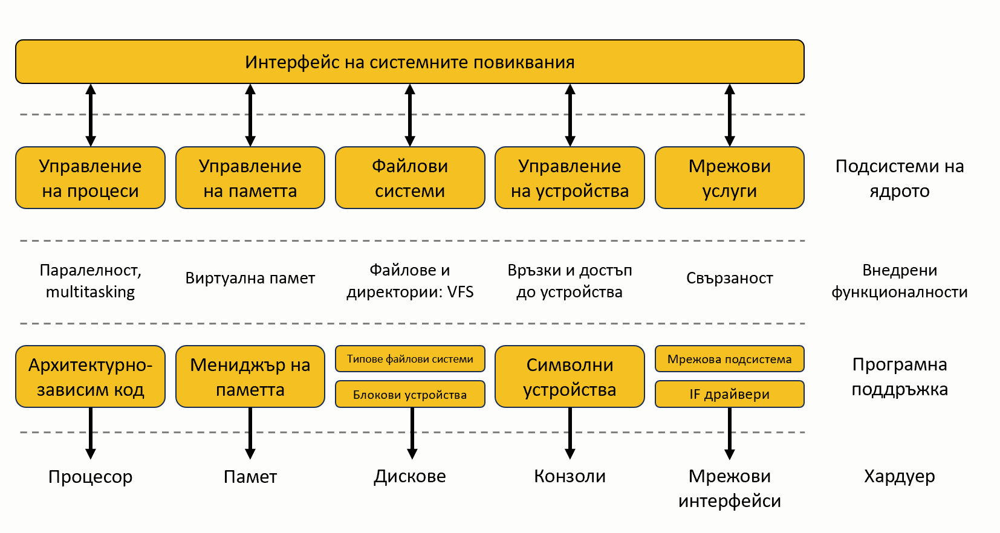

# Тема 201: Ядро на Linux (Linux Kernel)

Тема 201 е и ключът към разбирането на това как хардуерът и софтуерът общуват помежду си. Без това знание вие просто управлявате услуги. С него вие управлявате самата машина.

## 201.1 Компоненти на ядрото (Kernel Components)

### 1. Директории на ядрото (Картата на системата)

В света на Linux Kernel нищо не е скрито, но всичко си има строго определено място. Трябва да знаем къде стоят инструментите и продуктите ни. Без тези пътища не управлявате системата, а просто гадаете.

* **/usr/src/**: Традиционно място, където държим изходния код на софтуера и хедърите на ядрото. Те са ни нужни, когато трябва да компилираме нови драйвери.
  
* **/usr/src/linux/**: Обикновено това е символна връзка (link) към конкретната версия на ядрото, върху която работим в момента. Това е работилницата на програмиста.
  
* **/usr/src/linux/Documentation/**: Всяка функция, драйвер и скрит параметър е описан тук от създателите му. 
    > **Важно:** Доверявайте се на официалната документация, а не само на форуми.

* **/boot**: Оперативното ниво, където се съхраняват самите изображения на ядрото (файловете `vmlinuz`), които вашият Bootloader (като GRUB) намира при стартиране.
  
* **/lib/modules**: Тук са подредени всички компилирани драйвери, разделени в папки според версията на ядрото. Ако имате три различни ядра, тук ще имате три различни поддиректории.

### 2. Типове изображения и компресия

В света на Linux, "изображение" (Kernel Image) не е снимка или картинка. Това е просто един-единствен, специален изпълним файл, който съдържа целия машинен код на ядрото.

#### Компресия на изображението
Тъй като файлът на ядрото съдържа огромен брой инструкции и драйвери, той може да бъде доста голям. За да пести място на диска и да се зарежда по-бързо от Bootloader-а, ядрото се съхранява в компресиран вид. При стартиране на компютъра, първото нещо, което системата прави, е автоматично да декомпресира (разархивира) този файл директно в оперативната памет (RAM), за да може процесорът да започне да изпълнява кода му.

За компресия на изображението обикновено се ползва `gzip`, а за архивите със сорс код – `xz`. Буквата 'z' в края на `vmlinuz` означава, че изображението е компресирано.

#### Формати (zImage vs bzImage)
* **zImage**: По-старият формат, ограничен до 512 KB, който може да се зарежда само в "ниска памет" (low memory). Днес се среща главно при embedded системи.
  
* **bzImage**: Стандартът днес, който решава проблема с размера. Няма ограничение в размера и се зарежда във "високата памет" (high memory). Буквата 'b' не означава "big", а указва, че ядрото може да бъде заредено над границата от 1MB в паметта.

### 3. Архитектура на ядрото (Слоеве)



* **System Call Interface**: Входната врата, където приложенията подават заявки към ядрото (напр. запис на файл или изпращане на пакет).
  
* **Kernel Subsystems**: "Диспечерите" (Процеси, Памет, Файлови системи), които решават разпределението на процесорно време и RAM.
  
* **Software Support & Drivers**: Драйверите в `/lib/modules`, които превеждат командите към конкретния хардуер.
  
* **Hardware**: Физическият свят – процесор, дискове, мрежови карти.

### 4. Анатомия на версиите на ядрото

Използвайте командата `uname -r`, за да видите версията. Първите три цифри (Version, Patch, Sub-level) идват директно от ядрото (upstream/Mainline). Всичко след тирето е специфичната част на дистрибутора (downstream), която съдържа пачове за сигурност или хардуер.

**Примери:**
* **Ubuntu (5.4.0-189-generic)**: 
  * `5.4.0`: чистата версия
  * `189`: пачовете от Ubuntu
  * `generic`: означава масов хардуер.
  
* **Rocky Linux (5.14.0-570.52.1.el9_6.x86_64)**:
  * `5.14.0`: основната версия
  * `570.52.1`: пачове от Red Hat
  * `el9`: показва оптимизация за Enterprise Linux 9.

> **Забележка:** За да видите реалния размер на ядрото в мегабайти, използвайте `ls -lh /boot/vmlinuz-$(uname -r)`.

## 201.2 Компилиране на ядро (Compiling a kernel)

>**Важна забележка:**\
Оттук нататък, при изпълнението на скриптовете и командите, системата може периодично да спира и да ви задава въпроси за нови функции или модули (особено при `make oldconfig` или по време на самата компилация).
>
>**За целите на този курс:** Винаги натискайте **`Enter`**, за да приемете настройките по подразбиране. Те са напълно достатъчни за нашата учебна среда.
>
>**В реална работна среда:** Ако компилирате ядро за специфичен сървър (напр. за високопроизводителна база данни или специализиран хардуер), трябва внимателно да проучите всяка опция и да изберете конкретно това, което ви е необходимо за оптимизация.

### Подготовка на средата
Ядрото е най-сложният софтуер в системата и изисква специфични библиотеки. В Debian/Ubuntu средата се подготвя със следните пакети:
* **build-essential**: Съдържа компилатора `gcc` и инструмента `make`.
* **libncurses-dev**: Задължителен за визуалното меню за настройки (`menuconfig`).
* **libssl-dev & libelf-dev**: За сигурност и обработка на файловия формат на ядрото.
* **flex & bison**: Генератори за разчитане на конфигурационните скриптове.

За да улесним процеса и да не инсталираме пакетите ръчно един по един, ще използваме подготвения скрипт **[install_packages.sh](./scripts/install_packages.sh)**.

>**Важно**: Използване на **sudo**
>
>Всички команди, които инсталират компоненти или променят системни настройки(напр. `make modules_install`, `make install` или редакция на файлове в `/etc`), задължително се изпълняват със **sudo**.
>
>**Защо?** Защото тези операции модифицират системни директории (`/boot`, `/lib/modules`), до които само администраторът (`root`) има достъп. Без **sudo** системата ще откаже промените от съображения за сигурност.

### Сваляне и подготовка на сорс кода
Вместо да изпълняваме ръчно процеса стъпка по стъпка – сваляне на архива от kernel.org с `wget`, тежко разпакетиране с `tar` и създаване на символна връзка с `ln -s` – ще автоматизираме всичко това. 

За целта просто използвайте подготвения скрипт: **[download_latest_kernel.sh](./scripts/download_latest_kernel.sh)**

### Конфигурация (`.config`)
Конфигурационният файл `.config` казва на компилатора какво да включи и какво да изхвърли. За да генерирате този файл, е необходимо да влезете в `/usr/src/linux` и да изпълните **само една** от следните команди (по ваш избор):
* **make config**: Стар, бавен текстов режим. Задава хиляди въпроси един по един. Не се ползва в практиката.
  
* **make menuconfig**: Най-препоръчителният инструмент. Базиран на `ncurses`, позволява свободна навигация и персонализация със стрелки и интервал.
  
* **make oldconfig**: Копирате стария `.config` файл, и системата ви пита само за *новите* функции в новата версия. Всичко останало се пренася автоматично – това е стандартът в индустрията.
  
* **Графични интерфейси**: `make xconfig` (базиран на QT/KDE) и `make gconfig` (базиран на GTK/GNOME).

### Персонализация на името
* **EXTRAVERSION**: Редактирайте `Makefile` в `/usr/src/linux` и добавете инициали или текст (напр. `-1111`) към `EXTRAVERSION =`. Това помага за разпознаване на персонализираното ядро при изпълнение на `uname -r`.

    ```bash
    vim /usr/src/linux/Makefile
    ```


* **LOCALVERSION**: Може да се добави във файла `.config` чрез `CONFIG_LOCALVERSION=" -test-srv"`. Крайният резултат в `uname -r` ще е комбинация от двете.
    ```bash
    vim /usr/src/linux/.config
    ```

### Компилиране на Kernel Image 

След като конфигурационният файл е готов, преминаваме към същинската част – превръщането на сорс кода в изпълним файл (Image). Това е най-тежката задача за процесора и паметта на вашата машина.

За да избегнем чести грешки като недостиг на памет (Out of Memory) или проблеми с цифровите подписи (Trusted Keys), ще използваме подготвения скрипт: **[compile_kernel_image.sh](./scripts/compile_kernel_image.sh)**.

#### Какво прави този скрипт?

1. Подготвя конфигурацията: Копира настройките от текущото ви работещо ядро като база.

2. Премахва защити: Изключва изискването за CONFIG_SYSTEM_TRUSTED_KEYS, което често спира компилацията в Debian/Ubuntu среди.

3. Осигурява ресурси: Създава временен 4GB Swap файл. Това е критично, ако виртуалната ви машина има малко RAM – без него компилаторът ще "забие".

4. Стартира процеса по компилиране:: Изпълнява финалната команда:
make -j $(nproc) bzImage
   * -j $(nproc) казва на системата да използва всички налични процесорни ядра паралелно.
   * bzImage е форматът на готовото компресирано ядро.

>**Забележка:** Тази стъпка може да отнеме от 15 минути до над час, в зависимост от мощността на вашия компютър.

### Компилиране на модули

Вече имаме основния файл на ядрото (Kernel Image), но той сам по себе си е минималистичен. За да може вашето ядро да разпознава вашата мрежова карта, звук или USB устройства, ни трябват модулите.

Модулите са части от ядрото, които се зареждат само при нужда. Това прави системата гъвкава и лека. Сега ще изпълним командата за компилиране на стотиците малки драйвери, които избрахме в конфигурацията.

**1. Подготовка на местоположениетo** - преди да започнем с модулите, трябва да сме сигурни, че се намираме на правилното място:
    
```bash
cd /usr/src/linux
```

**Защо тук?**\
Защото това е директорията, в която разпакетирахме сорс кода на ядрото. Всички инструменти на make и конфигурационният ни файл .config се намират тук. Ако се опитате да стартирате компилация от домашната си папка, системата просто няма да знае какво да прави.

**2. Стартиране на компилацията** - сега изпълняваме командата:

```bash
sudo make -j $(nproc) modules
```

Тук ще впрегнем цялата мощ на нашия сървър, използвайки всички налични процесорни ядра, за да подготвим драйверите за работа.

### Инсталиране на модулите

След като модулите са компилирани, те все още се намират в папката със сорс кода. Сега е време да ги преместим там, където операционната система може да ги използва.

**1. Проверка на директорията** - отново се връщаме в нашата работна папка. Важно е да разберете, че командата `make` търси инструкциите си в текущата директория. Ако не сме в нея, системата няма да знае кои модули точно искаме да инсталираме.

```bash
cd /usr/src/linux
```

**2. Инсталация** - изпълняваме командата:

```bash
sudo make modules_install
```

**Какво се случва по време на този процес?**
* **Копиране:** До този момент нашите модули (драйверите) са просто компилирани файлове, разпръснати из сорс кода. С тази команда ние ги "изпращаме на работа". Тя взема всички тези `.ko` файлове (Kernel Objects) и ги копира в системната директория `/lib/modules/`.

* **Организация:** Там те ще бъдат подредени в папка, кръстена точно на версията на нашето ядро. Така системата ще знае точно кои драйвери да зареди, когато стартираме новото ядро.

* **Индексиране:** Докато командата работи, ще видите стотици редове, започващи с `INSTALL`. Когато процесът приключи с изпълнение на `depmod`, това означава, че системата вече е индексирала новите драйвери и те са готови за използване.

### Инсталиране на ядрото

**1. Проверка на директорията**
```bash
cd /usr/src/linux
```

**2. Финална инсталация**

```bash
sudo make install
```

**Какво прави тази команда автоматично?**
* **Копиране:** Тя пренася самото ядро (`vmlinuz`) в папката `/boot`.

* **Генериране на initrd:** Създава Initial RAM Disk - временна файлова система, която помага на ядрото да се инициализира и да открие дисковете при стартиране.

* **Обновяване на GRUB:** Автоматично добавя новото ядро в менюто на нашия Bootloader (GRUB), така че да можем да го изберем при рестарт.

**Защо ползваме този метод?**\
Може да срещнете и ръчен метод за копиране на файлове, но в професионалната практика `make install` е стандартът. Той е по-бърз, сигурен и гарантира, че няма да допуснете техническа грешка, която да попречи на системата да зареди.

**3. Проверка на резултата**
След като командата приключи, проверете съдържанието на `/boot`:

```bash
ls -lh /boot
```

Ако виждате файлове, които завършват на версията на вашето ядро (напр. ```vmlinuz-6.12.1```), значи сте успели да компилирате и инсталирате ядро от сорс код.

### Почистване след компилация (Cleanup)
Прави се **само** след като сте сигурни, че новото ядро работи стабилно.
* **make clean**: Безопасно почистване - изтрива само междинните файлове, но запазва вашия `.config`.

* **make mrproper**: Пълно зануляване - изтрива всичко, включително конфигурационния файл, връщайки папката в начален вид.


### Initramfs и управление
`Initramfs` е малка временна файлова система, зареждана в RAM преди ядрото, съдържаща нужните драйвери за монтиране на истинския диск. Размерът на файла е около 30-60 MB.

* **mkinitrd**: стар стандарт, който днес действа като обвивка за `dracut`. 

* **dracut**: `dracut --force` прегенерира файла за текущото ядро автоматично.

* **mkinitramfs** (Debian/Ubuntu): Работи аналогично, но за Debian фамилията.
   
    **Пример:** 
    ```bash
    sudo mkinitramfs -o /boot/backup-initramfs.img $(uname -r)
    ```
### GNU Make и пакетиране
`make` чете инструкции от **Makefile** и управлява процеса по компилиране ефективно - ако няма промени, не прекомпилира излишно. В корпоративна среда ядрото се пакетира за лесна дистрибуция:

* **make deb-pkg**: генерира `.deb` пакет за **Debian/Ubuntu**
* **make rpm-pkg**: генерира пълен `.rpm` пакет (вкл. сорс) за **RedHat/CentOS**
* **make binrpm-pkg**: генерира само изпълним `.rpm` пакет

### Инструменти за компресия: Gzip vs Bzip2
* **Gzip (GNU Zip)**: Използва се за бърза, ежедневна компресия.
    * **Нива**: `-1` (най-бързо, слабо) до `-9` (най-бавно, силно).
    * **Декомпресия**: с `gunzip` или `gzip -d`. 
    * **Запазване на оригинала**: с `-c` и `>`.
* **Bzip2**:Предпочитан за сорс код. 
    * **Ефективност**: По-добра компресия (по-малки файлове), но изисква повече процесорно време.
    * **Декомпресия**: с `bunzip2` или `bzip2 -d`.

### DKMS (Dynamic Kernel Module Support)
Автоматизирана система, която прекомпилира външни драйвери (напр. ZFS, видеокарти) автоматично при обновяване на версията на ядрото.
* **dkms status**: показва инсталираните модули и за кои ядра са "закачени".
* **dkms add**: добавя сорс кода на драйвера в базата.
* **dkms remove**: премахва модула (напр. `dkms remove zfs/2.0.3 --all`).

## 201.3 Управление и диагностика на ядрото в реално време (Kernel runtime management and troubleshooting)

Системните инструменти могат да бъдат групирани в три категории: управление на модули (драйвери), настройка на работещото ядро и разпознаване на физическия хардуер. Това разграничение осигурява ясна структура при работа със системата.

### Група 1: Модули и зависимости

Тук са файловете и инструментите, които казват на ядрото как да намира драйверите.

* **/lib/modules/[kernel-version]/modules.dep**: Това е най-важният файл за зависимостите. Той съдържа списък на това кои модули изискват други модули, за да работят.
  
* **/sbin/depmod**: Анализира всички модули в `/lib/modules/` и презаписва файла `modules.dep`. Тя "индексира" драйверите.
  
* **Конфигурационни файлове в /etc/**: Тук се намират файловете (обикновено в `/etc/modprobe.d/`), където можем да задаваме псевдоними (**aliases**) или да забраняваме автоматичното зареждане на определени модули (**blacklisting**).

* **/sbin/lsmod**: Показва списък на всички текущо заредени модули в паметта.

* **/sbin/modinfo**: Извлича детайлна информация за конкретен модул - автор, описание, лиценз и какви параметри приема.

* **/sbin/modprobe**: Интелигентната команда за зареждане. Тя чете `modules.dep` и ако поискате един модул, тя автоматично зарежда и всички други, от които той зависи.

* **/sbin/insmod**: Директно вмъкване на модул. Не се интересува от зависимости, просто се опитва да зареди конкретен файл.

* **/sbin/rmmod**: Команда за премахване на модул от паметта.

### Група 2: Настройка и диагностика на ядрото

Тези обекти позволяват да виждаме какво мисли ядрото и да го настройваме в реално време.

* **/proc/sys/kernel/**: Директория във "виртуалната" файлова система, където всеки файл представлява конкретна настройка на ядрото (напр. име на хост, лимити на паметта и др.).

* **/sbin/sysctl**: Инструментът за четене и писане в тези виртуални файлове. Използва се за промяна на параметри без рестарт.

* **/etc/sysctl.conf** & **/etc/sysctl.d/**: Мястото, където записваме нашите настройки за `sysctl`, за да бъдат приложени автоматично при всяко стартиране на машината.

* **/bin/uname**: Дава базова информация за ядрото - версия, архитектура и име на операционната система.
  
* **/bin/dmesg**: Командата, която извежда съобщенията от "пръстеновидния буфер" на ядрото. Това е първото място, където гледаме при хардуерен проблем.

### Група 3: Хардуер и устройства

Инструменти за идентификация на физическия хардуер и неговото управление.

* **/sbin/lspci**: Изброява всички устройства на PCI шината (видеокарти, мрежови карти, контролери).

* **/usr/bin/lsusb**: Изброява всички свързани USB устройства.

* **/usr/bin/lsdev**: Показва информация за инсталирания хардуер, включително IRQ портове и DMA канали.

* **/etc/udev/**: Главната директория за управление на устройствата. Тук се съхраняват правилата, по които се създават файловете в `/dev/`.

* **udevadm monitor** (и по-стария `udevmonitor`): Инструменти за наблюдение в реално време. Показват събитията, които ядрото изпраща, когато включите или изключите хардуер.

> **Забележка:** 
> - Когато се борите с драйвери – използвате **Група 1**. 
> 
> - Когато искате да разберете нещо за ядрото – използвате **Група 2**. 
>
> - Когато се чудите дали компютърът изобщо "вижда" новата мрежова карта – използвате **Група 3**.

---

### Команда: `uname` (Unix Name)

Тя е фундаментална, защото преди да променяме каквото и да е по ядрото, трябва да знаем точно върху какво работим.

**Предназначение:** Извличане на системна информация директно от ядрото.

| Флаг | Значение | Какво ще видиш при теб? |
| :--- | :--- | :--- |
| **-a** | Всичко | Пълният низ с информация (комбинация от всички флагове). |
| **-s** | Kernel Name | Обикновено `Linux`. |
| **-r** | Kernel Release | Тук трябва да видиш твоята версия (напр. `6.12.1-1111`). |
| **-v** | Build Version | Датата и часът, в който е стартирана компилацията (`make`). |
| **-n** | Hostname | Името на твоята машина (напр. `ubuntu-srv`). |
| **-m** | Hardware Name | Архитектурата (напр. `x86_64`). |
| **-o** | OS | Операционната система (напр. `GNU/Linux`). |

> **Важно:** `uname` е вашият основен инструмент за идентифициране на системата в Linux. Преди да инсталирате драйвери или да дебъгвате, първата ви работа е да проверите версията с `uname -r`.
>
>Забележете разликата между `-r` (release) и `-v` (version). **Release** е номерът на версията, а **Version** е конкретният момент, в който това ядро е било компилирано. Ако компилирате ядро три пъти днес, изходът от `-r` ще е еднакъв, но изходът от `-v` ще се променя всеки път.

**Забележка**: Флаговете `-p` и `-i` се считат за остарели (legacy). На повечето модерни Linux системи те ще върнат `unknown`. За надеждна информация винаги използвайте `-m`.

---

### Команда: `sysctl`

**Предназначение:** Конфигуриране на параметри на ядрото в реално време (runtime). Тези параметри се намират в дигиталното "съзнание" на системата - директорията `/proc/sys/`.

#### 1. Наблюдение и временни промени
Когато променяте нещо със `sysctl` директно в терминала, то влиза в сила веднага, но ще бъде **изгубено след рестарт**.

* **`sysctl -a`**: Показва всички налични параметри, които могат да бъдат настройвани.

**Пример 1 (Максимум отворени файлове):** 

```bash
sysctl fs.file-max=400000
```

Увеличава лимита на файловете, които системата може да поддържа едновременно (критично за големи бази данни).

**Пример 2 (Скриване от Ping чрез /proc):** 

```bash
echo 1 > /proc/sys/net/ipv4/icmp_echo_ignore_all
```

Това е алтернативен начин. Пишете директно във виртуалния файл. Резултатът е същият - сървърът спира да отговаря на **ping**.

#### 2. Перманентни промени (Persistent)
За да не се нулират настройките ви след рестарт, трябва да ги запишете в конфигурационните файлове.

* **Главният файл:** `/etc/sysctl.conf`.\
  Редактирате с `vim` и добавяте: `fs.file-max = 400000`

* **Модерният подход (Директорията .d):**\
  Създавате собствен конфигурационен файл (напр. `/etc/sysctl.d/99-custom.conf`). Този подход е по-чист, по-лесен за архивиране и намалява риска от промяна на системните настройки по подразбиране.

> **Важно:** Има два начина да промените параметър - чрез командата `sysctl` или чрез `echo` директно в `/proc/sys/`. Резултатът е идентичен, защото `sysctl` е просто удобен интерфейс към `/proc`. 
> 
> Промените, направени по този начин (`sysctl -w` или `echo`), са временни и важат до следващия рестарт. За да останат постоянни, трябва да ги запишете в конфигурационен файл (напр. `/etc/sysctl.conf` или в `/etc/sysctl.d/`).

---

### Команда: `lspci` (List PCI)

**Предназначение:** Показва детайлна информация за всички устройства на PCI шината - видеокарти, мрежови адаптери, RAID контролери и USB шини. Тя е незаменима, за да разберете дали ядрото разпознава физическите компоненти.

* **`lspci`**: Базов списък. Показва адреса на устройството, класа и модела.

* **`lspci -k`**: Показва не само устройството, но и кой драйвер (Kernel Driver) го управлява в момента и кои модули са налични за него.

* **`lspci -s [идентификатор] -v`**: Подробна (verbose) информация за конкретно устройство по идентификатор (напр. `00:03.0`).

##### Анализ на PCI устройството (Пример)
* **`0b:00.0`**: PCI адресът
  * `0b` = шина (Bus)
  * `00` = устройство (Device)
  * `.0` = функция (Function)
  
* **`USB controller: VMware Device 077a (prog-if 30 [XHCI])`**: XHCI означава USB 3.0 контролер.
  
* **`Flags: bus master`**: Устройство, което може само да инициира транзакции по шината.
  
* **`IRQ 19`**: Прекъсване (Interrupt Request) - сигнал, чрез който устройството уведомява процесора, че изисква внимание.
  
* **`Memory at fd3e0000 ... [size=128K]`**: Адресът в оперативната памет (Memory Mapped I/O).
  
* **`Capabilities: <access denied>`**: Ядрото изисква `sudo` права за пълно четене.
  
* **`Kernel driver in use: xhci_hcd`**: Показва кой драйвер управлява устройството в момента.

> **Важно:** Ако мрежовата карта не работи, пуснете `lspci`. Ако я има в списъка – хардуерът е разпознат. Ако при `lspci -k` липсва редът *Kernel driver in use*, това означава, че ядрото разпознава хардуера, но не е зареден подходящ драйвер. В такъв случай трябва да заредите съответния модул с `modprobe`.

---

### Команда: `lsusb` (List USB)

**Предназначение:** Показва информация за всички USB шини и свързаните към тях устройства (клавиатури, мишки, дискове). По-проста от `lspci`, но критична за периферията.

**Инсталация (за Debian/Ubuntu):**
```bash
sudo apt update
sudo apt install usbutils
```

* **lsusb**: Базов списък на USB устройствата. Показва идентификатори на производителя и устройството (VendorID:ProductID).
  
* **lsusb -t** (Tree): Показва йерархията на USB устройствата, включително към кой хъб и порт е свързано всяко устройство, както и скоростта на връзката (напр. 480M за USB 2.0, 5000M за USB 3.0).
  
* **lsusb -v -d [ID]**: Извежда подробна информация за конкретно устройство - дескриптори, консумация на енергия и други технически параметри.

>**Забележка**: Ако включите устройство и то не се появява в `lsusb`, проблемът вероятно е в кабела или порта. Ако го виждате, но не функционира правилно, е възможно да липсва подходящ драйвер.
>
> Флагът `-t` е особено полезен за проверка на USB топологията и скоростта на връзката - например дали бърз външен диск не е ограничен от стар USB 1.1 хъб.

---

### Група: Диагностика и управление на модули
За някои от тези инструменти може да е необходим пакетът procinfo, който се инсталира по следния начин:

```bash
sudo apt install procinfo
```

1. **lsdev** (List Devices): Обобщава хардуерна информация от /proc. Дава бърз поглед върху използваните IRQ прекъсвания, DMA канали и I/O портове.

2. **dmesg** (Display Message): Извежда съобщенията от "пръстеновидния буфер" (ring buffer). Това е системният log буфер, в който се записват съобщения и грешки, включително при инициализация на нов хардуер.
   * **dmesg -C**: изчиства буфера

3. **depmod**: Анализира наличните модули и презаписва файла със зависимости modules.dep.
   * **depmod -a**: сканира всичко

4. **lsmod**: Показва текущо заредените модули в паметта, размера им и кой ги използва (чете от `/proc/modules`).

5. **modinfo**: Извлича информация (автор, лиценз, параметри с `-p`) директно от **.ko** файла на модула, без да го зарежда.

6. **insmod**: Ръчно вмъкване на модул по пълен път. Не разрешава зависимости и може да не успее, ако те не са предварително заредени.

7. **rmmod**: Премахва модул от паметта. Отказва, ако модулът се ползва активно.

8. **modprobe**: Знае всичко за зависимостите от `modules.dep`.

9.  **modprobe [име]**: Зарежда модула и всички негови зависимости.

10. **modprobe -r [име]**: Премахва модула интелигентно (заедно с ненужните зависимости).
    **Пример:** `modprobe psmouse resync_time=10` - променя поведението на драйвера още при зареждането му

11. **udevadm**: Управлява подсистемата `udev` (която създава файловете в `/dev/`).

12. **udevadm info [път]**: Пълни детайли за устройство (за писане на `udev` правила).

13. **udevadm monitor**: Стартира мониторинг на събития от устройствената подсистема. При включване на флашка може да се наблюдава в реално време как ядрото генерира и изпраща събития за новото устройство.

>**Забележка**: Ако трябва да запомните само една команда за драйвери, това е `modprobe` - тя е като инсталатор на приложения, знае какво ѝ трябва. А `udevadm monitor` е инструмент за наблюдение в реално време на събитията от хардуерната подсистема - бърз начин да проверите дали системата регистрира включване на устройство.


### Ключови /etc и /lib директории

* **/etc/modprobe.d/**: Тук използваме конфигурационни файлове, за да променяме поведението на модулите. Най-честият сценарий е т.нар. **Blacklisting** - ако два драйвера се борят за едно и също устройство, тук казваме на единия да не се зарежда. Също така тук задаваме специфични параметри, като например скорост на трансфер или режими на работа на хардуера.

* **/etc/modules.conf**: Този файл е наследен от по-стари Linux системи. В съвременните дистрибуции функционалността му е заменена от конфигурация чрез директориите `.d`. В модерната практика рядко се използва и обикновено не се редактира на съвременни системи.
  
* **/etc/modules**: Това е най-лесният начин за автоматично зареждане на модули. Файлът съдържа списък с имена на модули, всеки на нов ред, които се зареждат от ядрото по време на стартиране (`boot`). Използва се за критични драйвери, без които системата не може да функционира правилно.
  
* **/etc/modules-load.d/**: Това е модерният подход на `systemd`. Вместо всички модули да са натрупани в един файл, тук всяка услуга или хардуер може да има свой собствен малък файл. Това е много по-безопасно – ако инсталирате нов софтуер, той добавя файл тук, без да рискува да повреди вашите ръчни настройки в основния файл `/etc/modules`.
  
* **/etc/udev/udev.conf**: Конфигурационен файл за настройките на `udev` демона. Тук се определя поведението на системата за управление на устройствата, включително нивото на логване (`logging priority`). Обикновено рядко се налага редакция, освен при диагностика или отстраняване на проблеми с `udev`.
  
* **/etc/udev/rules.d/**: Директория за потребителски `udev` правила. Тук се добавят правила за управление на устройства, например за задаване на постоянно име на конкретен диск или автоматично изпълнение на действия при включване на устройство. Правилата в тази директория имат приоритет и не се презаписват при системни обновления.
  
* **/lib/udev/rules.d/**: Директория, съдържаща системните `udev` правила по подразбиране, предоставени от дистрибуцията (напр. Ubuntu или Debian). Тези файлове не трябва да се редактират директно, тъй като могат да бъдат презаписани при обновяване на системата. Ако е необходима промяна, съответното правило се копира в `/etc/udev/rules.d/` и се модифицира там. Приоритет имат правилата в `/etc/udev/rules.d/`.